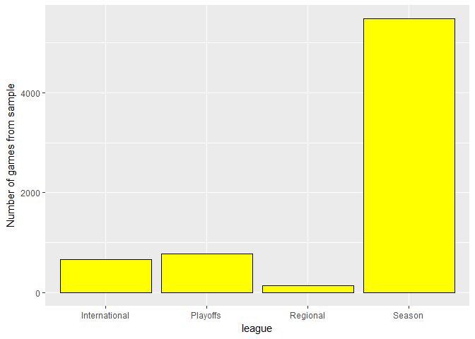
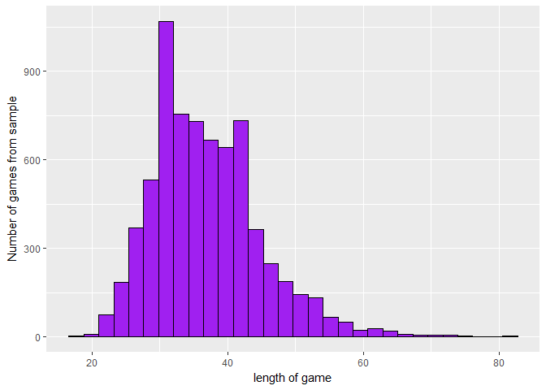
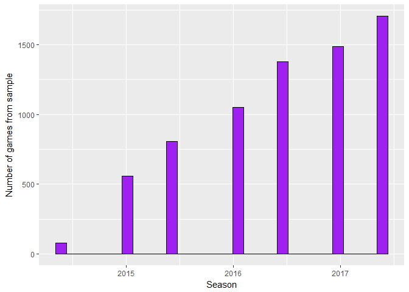
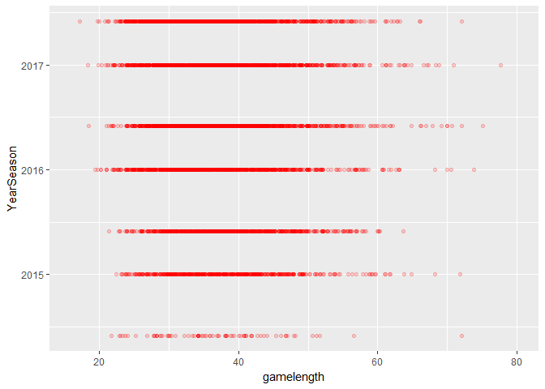
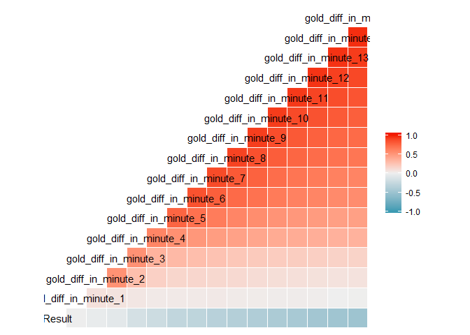
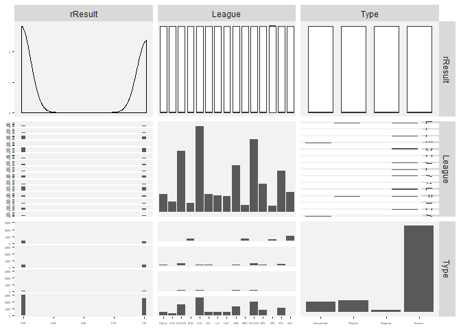
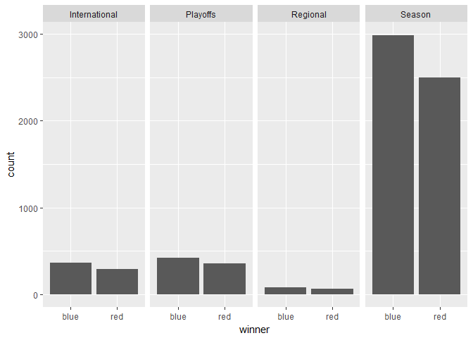
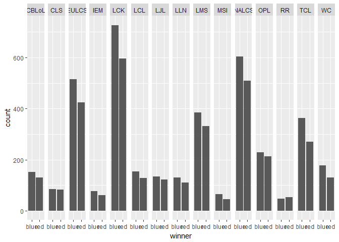
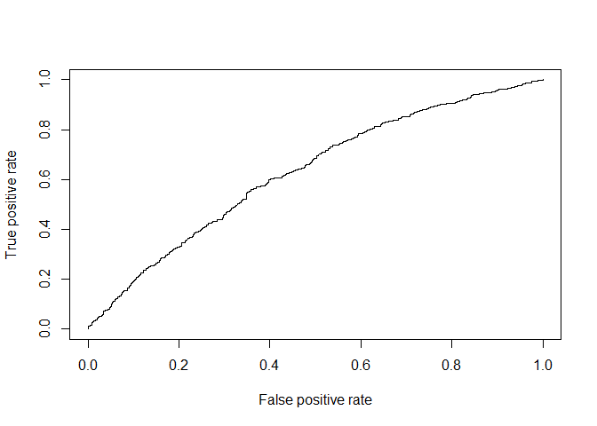

Research question: see dreamteam files
========================================================
#### Table of content (type of analysis)
Section 0: preparing data (no results shown)  
Section 1: exploring variables and relations (mostly univariate and some
bivariate)
Section 2: exploring differnces between results (won/vs lost) and control (bi- and multivariate)  
Section 3: other relations between variables (bi- and multivariate)  
Section 4: building models  
Section 5: testing models

> **Data source**: League of Legends competitive matches between 2015-2017. The matches include the NALCS, EULCS, LCK, LMS, and CBLoL leagues as well as the World Championship and Mid-Season Invitational tournaments. https://www.kaggle.com/chuckephron/leagueoflegends


```r
library(pscl)
```

```
## Warning: package 'pscl' was built under R version 3.4.3
```

```
## Classes and Methods for R developed in the
## Political Science Computational Laboratory
## Department of Political Science
## Stanford University
## Simon Jackman
## hurdle and zeroinfl functions by Achim Zeileis
```

```r
library(ROCR)
```

```
## Warning: package 'ROCR' was built under R version 3.4.3
```

```
## Loading required package: gplots
```

```
## Warning: package 'gplots' was built under R version 3.4.3
```

```
## 
## Attaching package: 'gplots'
```

```
## The following object is masked from 'package:stats':
## 
##     lowess
```

```r
library(taRifx)
```

```
## Warning: package 'taRifx' was built under R version 3.4.3
```

```r
library(ggplot2)
```

```
## Warning: package 'ggplot2' was built under R version 3.4.2
```

```r
# library(bitops)
library(tidyr)
```

```
## Warning: package 'tidyr' was built under R version 3.4.3
```

```r
# library(RCurl)
# library(ggthemes)
# library(foreign)
# library(grid)
# library(RColorBrewer)
# library(gridExtra)
# library(reshape2)
library(stringr)
```

```
## Warning: package 'stringr' was built under R version 3.4.2
```

```r
# library(scales)
library(dplyr)
```

```
## Warning: package 'dplyr' was built under R version 3.4.2
```

```
## 
## Attaching package: 'dplyr'
```

```
## The following objects are masked from 'package:taRifx':
## 
##     between, distinct, first, last
```

```
## The following objects are masked from 'package:stats':
## 
##     filter, lag
```

```
## The following objects are masked from 'package:base':
## 
##     intersect, setdiff, setequal, union
```

```r
library(GGally)
```

```
## Warning: package 'GGally' was built under R version 3.4.2
```

```
## 
## Attaching package: 'GGally'
```

```
## The following object is masked from 'package:dplyr':
## 
##     nasa
```

```r
# library(memisc)
# library(lattice)
# library(MASS)
```


```r
# Source: https://www.kaggle.com/chuckephron/leagueoflegends
getwd()
```

```
## [1] "C:/Users/User/Documents/KE5107_LeagueofLegends"
```

```r
# Tip: don't run seperately with load command.
# PC:
# setwd('C:/Users/Gebruiker 1/Dropbox/NUS/Data mining/leagueoflegends')
# laptop:
setwd('C:/Users/User/Dropbox/NUS/Data mining/leagueoflegends')

# load data file
matches <- read.csv("matches.csv", header=TRUE, sep=",")
```


```r
# 0.3.1 cuberoot
cuberoot_trans = function() trans_new('cuberoot', 
                                      transform = function(x) x^(1/3), 
                                      inverse = function(x) X^3)

# 0.3.2 Define new column names: takes in the max number for column and a name, outputs multiple columns
# Problem: appending to an object in a for loop causes the entire object to be copied on every iteration --> very slow.
create_column_names <- function(columns, namestring){
  maxnr <- max(matches$columns)
  vectofnr = c();
  for (i in 1:columns){
    # print(i)
    vectofnr[i] <- paste(namestring, as.character(i), sep="_")
    # print(vectofnr)
  }
  return(vectofnr)
}

 
# because it is so slow, maybe you can also put it in a global var:
# listofcolumns <- create_column_names(gamelength, 'gold')

# 0.3.3 remove the first and last char
remove_first_last <- function(inputstring){
  return(substring(inputstring, 2, str_length(inputstring)-1))
}
```


```r
# 0.4.1 viewing & correcting types
str(matches)
```

```
## 'data.frame':	7058 obs. of  57 variables:
##  $ League          : Factor w/ 15 levels "CBLoL","CLS",..: 11 11 11 11 11 11 11 11 11 11 ...
##  $ Year            : int  2015 2015 2015 2015 2015 2015 2015 2015 2015 2015 ...
##  $ Season          : Factor w/ 2 levels "Spring","Summer": 1 1 1 1 1 1 1 1 1 1 ...
##  $ Type            : Factor w/ 4 levels "International",..: 4 4 4 4 4 4 4 4 4 4 ...
##  $ blueTeamTag     : Factor w/ 186 levels "","7h","A","AE",..: 169 37 180 164 30 42 37 165 25 162 ...
##  $ bResult         : int  1 0 1 0 1 0 1 1 0 1 ...
##  $ rResult         : int  0 1 0 1 0 1 0 0 1 0 ...
##  $ redTeamTag      : Factor w/ 185 levels "","7h","A","AE",..: 24 41 68 164 161 163 179 29 68 168 ...
##  $ gamelength      : int  40 38 40 41 35 24 39 43 41 32 ...
##  $ golddiff        : Factor w/ 7058 levels "[-40, -32, -32, 135, -37, 859, 804, 891, 1117, 1049, 1297, 2077, 2410, 2897, 5189, 5230, 8855, 10616, 11288, 14"| __truncated__,..: 1162 1685 3591 1217 7029 4297 6536 4576 184 3528 ...
##  $ goldblue        : Factor w/ 7058 levels "[2375, 2375, 2660, 3836, 5105, 6230, 7602, 8685, 10530, 11526, 12816, 13989, 15460, 17302, 19014, 21368, 24006,"| __truncated__,..: 475 285 849 140 368 804 1364 941 717 501 ...
##  $ bKills          : Factor w/ 7021 levels "[[0.907, 'ANC ikssu', 'LZ Sonstar', ['LZ Expession', 'LZ TusiN', 'LZ Frozen', 'LZ IgNar'], 4920, 12465], [5.809"| __truncated__,..: 484 596 4479 6158 726 620 5631 3871 5832 3268 ...
##  $ bTowers         : Factor w/ 6823 levels "[[10.02, 'BOT_LANE', 'OUTER_TURRET']]",..: 4030 3045 914 2277 2896 6823 3346 703 3256 2284 ...
##  $ bInhibs         : Factor w/ 4178 levels "[[11.599, 'BOT_LANE']]",..: 2863 4178 3000 4178 2362 4178 2715 3561 4178 628 ...
##  $ bDragons        : Factor w/ 5644 levels "[[10.002, None], [28.955, None], [16.368, None]]",..: 4871 4469 3076 5644 862 5644 4791 250 5644 1996 ...
##  $ bBarons         : Factor w/ 3775 levels "[[20.151]]","[[20.166]]",..: 3775 1851 2896 3181 2524 3775 1736 2334 199 1466 ...
##  $ bHeralds        : Factor w/ 1920 levels "[[10.009]]","[[10.104]]",..: 1920 1920 1920 1920 1920 1920 1920 1920 1920 1920 ...
##  $ goldred         : Factor w/ 7058 levels "[2375, 2375, 2660, 3668, 4550, 5807, 7089, 8537, 9911, 11103, 12463, 13556, 15037, 16538, 17613, 19115, 20519, "| __truncated__,..: 830 970 684 755 8 218 1254 160 1306 545 ...
##  $ rKills          : Factor w/ 6995 levels "[[0.845, 'kt hachani', 'JAG Pilot', ['JAG TrAce', 'JAG Chei'], 12376, 1446], [16.187, 'kt Ssumday', 'JAG Pilot'"| __truncated__,..: 1846 1022 6190 5827 892 960 4752 1959 3131 777 ...
##  $ rTowers         : Factor w/ 6611 levels "[[10.002, 'BOT_LANE', 'OUTER_TURRET'], [22.24, 'MID_LANE', 'OUTER_TURRET'], [24.324, 'TOP_LANE', 'OUTER_TURRET']]",..: 5808 2011 3300 5533 236 1645 652 3883 2722 2095 ...
##  $ rInhibs         : Factor w/ 3534 levels "[[11.632, 'TOP_LANE'], [33.73, 'TOP_LANE'], [35.697, 'MID_LANE']]",..: 3534 2260 3534 2104 3534 46 3534 3534 1621 3534 ...
##  $ rDragons        : Factor w/ 5604 levels "[[10.0, 'FIRE_DRAGON'], [25.706, 'EARTH_DRAGON']]",..: 1602 575 5604 3512 2651 1269 5470 4370 2762 3620 ...
##  $ rBarons         : Factor w/ 3577 levels "[[20.162]]","[[20.183]]",..: 1829 3577 3577 3577 3577 3577 3577 3577 2225 3577 ...
##  $ rHeralds        : Factor w/ 1534 levels "[[10.026]]","[[10.08]]",..: 1534 1534 1534 1534 1534 1534 1534 1534 1534 1534 ...
##  $ blueTop         : Factor w/ 273 levels "","3z","957",..: 70 58 89 196 36 92 58 181 34 49 ...
##  $ blueTopChamp    : Factor w/ 75 levels "Akali","Alistar",..: 22 17 51 22 17 26 22 51 60 22 ...
##  $ goldblueTop     : Factor w/ 7058 levels "[475, 475, 1232, 1446, 1807, 2073, 2366, 2716, 2892, 3369, 3741, 4102, 4387, 4857, 5516, 5870, 6189, 6858, 7153"| __truncated__,..: 130 564 867 26 305 342 1010 515 1215 637 ...
##  $ blueJungle      : Factor w/ 304 levels "","=","007x",..: 225 120 237 221 293 60 120 127 169 201 ...
##  $ blueJungleChamp : Factor w/ 56 levels "Alistar","Amumu",..: 41 42 42 21 21 42 21 21 41 35 ...
##  $ goldblueJungle  : Factor w/ 7058 levels "[475, 475, 1147, 1410, 1732, 1956, 2497, 2719, 3349, 3659, 4025, 4593, 4968, 5631, 6146, 7574, 8215, 8850, 9283"| __truncated__,..: 603 720 1330 803 409 714 1210 118 688 122 ...
##  $ blueMiddle      : Factor w/ 273 levels "","Abaria","Abbedagge",..: 23 119 189 265 139 220 119 82 106 227 ...
##  $ blueMiddleChamp : Factor w/ 67 levels "Ahri","Anivia",..: 1 1 14 32 34 32 63 4 45 45 ...
##  $ goldblueMiddle  : Factor w/ 7058 levels "[475, 475, 1156, 1405, 1741, 2108, 2386, 2975, 3265, 3563, 3919, 4377, 4644, 4946, 5339, 5698, 6281, 6450, 6776"| __truncated__,..: 302 363 774 222 252 72 792 1141 84 407 ...
##  $ blueADC         : Factor w/ 291 levels "","0hq","2020",..: 269 135 9 15 55 38 135 105 223 133 ...
##  $ blueADCChamp    : Factor w/ 29 levels "Alistar","Ashe",..: 12 4 21 21 22 21 5 4 16 21 ...
##  $ goldblueADC     : Factor w/ 7058 levels "[475, 475, 1176, 1437, 2011, 2206, 2723, 3025, 3482, 3709, 4354, 4791, 5427, 5665, 6172, 6988, 7430, 8538, 8890"| __truncated__,..: 392 747 1030 341 770 1220 1126 534 154 292 ...
##  $ blueSupport     : Factor w/ 295 levels "","Adrian","Air",..: 145 216 88 2 9 129 216 280 139 64 ...
##  $ blueSupportChamp: Factor w/ 53 levels "Ahri","Alistar",..: 18 24 3 47 18 3 18 3 18 33 ...
##  $ goldblueSupport : Factor w/ 7058 levels "[475, 475, 532, 684, 838, 971, 1104, 1275, 1408, 1522, 1692, 1826, 1975, 2207, 2352, 2617, 2951, 3508, 3827, 41"| __truncated__,..: 6557 6154 6713 5838 6461 6603 7037 6556 6529 6642 ...
##  $ blueBans        : Factor w/ 6725 levels "['Ahri', 'Corki', 'Ryze']",..: 4571 2525 1957 148 1838 3228 6508 3276 1945 4555 ...
##  $ redTop          : Factor w/ 278 levels "","3z","957",..: 35 93 99 187 49 202 90 36 99 70 ...
##  $ redTopChamp     : Factor w/ 78 levels "Aatrox","Akali",..: 16 22 63 16 63 16 53 56 27 16 ...
##  $ goldredTop      : Factor w/ 7058 levels "[475, 475, 531, 700, 1018, 1314, 1586, 1911, 2113, 2341, 2572, 2922, 3243, 3567, 3979, 4229, 4755, 5146, 5390, "| __truncated__,..: 295 708 939 320 743 599 1119 228 318 128 ...
##  $ redJungle       : Factor w/ 305 levels "","=","007x",..: 169 58 223 126 200 220 236 294 223 224 ...
##  $ redJungleChamp  : Factor w/ 59 levels "Aatrox","Amumu",..: 8 19 26 36 43 19 26 44 55 44 ...
##  $ goldredJungle   : Factor w/ 7058 levels "[475, 475, 531, 816, 999, 1195, 1405, 1606, 1938, 2177, 2691, 2981, 3210, 4072, 4370, 4608, 4824, 4988, 5129, 5"| __truncated__,..: 763 796 1143 1322 753 27 1133 274 83 390 ...
##  $ redMiddle       : Factor w/ 275 levels "","Abaria","Abbedagge",..: 107 223 125 81 230 267 190 140 125 22 ...
##  $ redMiddleChamp  : Factor w/ 74 levels "Ahri","Alistar",..: 15 5 5 36 36 36 33 33 71 33 ...
##  $ goldredMiddle   : Factor w/ 7058 levels "[475, 475, 531, 731, 1051, 1347, 1619, 2021, 2322, 2818, 2948, 3274, 3500, 3955, 4301, 4593, 5184, 5531, 5770, "| __truncated__,..: 1195 1130 861 75 338 460 1282 463 144 694 ...
##  $ redADC          : Factor w/ 289 levels "","0hq","2020",..: 221 38 37 103 132 15 9 54 37 267 ...
##  $ redADCChamp     : Factor w/ 34 levels "Ashe","Caitlyn",..: 23 3 3 16 3 3 27 23 3 6 ...
##  $ goldredADC      : Factor w/ 7058 levels "[475, 475, 531, 776, 1150, 1446, 1738, 2115, 2410, 2691, 3153, 3632, 3938, 4311, 4777, 5213, 5547, 5916, 6186, "| __truncated__,..: 185 820 994 199 361 584 973 173 124 400 ...
##  $ redSupport      : Factor w/ 295 levels "","Adrian","Air",..: 139 129 32 280 64 2 88 10 31 145 ...
##  $ redSupportChamp : Factor w/ 54 levels "Alistar","Annie",..: 45 2 15 15 2 45 31 5 30 30 ...
##  $ goldredSupport  : Factor w/ 7058 levels "[475, 475, 532, 646, 761, 875, 989, 1102, 1366, 1496, 1670, 1958, 2122, 2549, 2685, 2879, 2992, 3315, 3430, 369"| __truncated__,..: 5956 6673 6737 6562 11 6148 6959 5931 7004 6568 ...
##  $ redBans         : Factor w/ 6440 levels "['Aatrox', 'Nidalee', 'Alistar']",..: 5169 4032 3085 4077 4366 267 4026 3848 4337 4036 ...
##  $ Address         : Factor w/ 7058 levels "http://matchhistory.br.leagueoflegends.com/pt/#match-details/ESPORTSTMNT02/300266?gameHash=aa0e58f00d1d18e0",..: 4237 4238 4239 4240 4241 4242 4243 4244 4245 4246 ...
```

```r
# Types seem ok, but have to correct the adjusted variables.

## 0.4.2 making interpretation (and graphs) more easy by adding winner (blue or red) column
matches$winner <- ifelse(matches$bResult > 0, c("blue"), c("red"))

## 0.4.3 get rid of [ & ] for later use --> only use once!
matches$goldblue <- remove_first_last(matches$goldblue)
matches$golddiff <- remove_first_last(matches$golddiff)
matches$goldred <- remove_first_last(matches$goldred)
matches$blueBans <- remove_first_last(matches$blueBans)
matches$redBans <- remove_first_last(matches$redBans)


## 0.4.4 Square the data if scewed 

# to do
```


```r
# make a better match variable for easy reading.
matches$winner <- ifelse(matches$bResult > 0, c("blue"), c("red"))

# make a better time variable out of year and season
matches$YearSeason <- ifelse(matches$Season == "Spring", paste("01/01/", as.character(matches$Year), sep=""), paste("01/06/", as.character(matches$Year), sep=""))

str(matches$YearSeason)
```

```
##  chr [1:7058] "01/01/2015" "01/01/2015" "01/01/2015" "01/01/2015" ...
```

```r
summary(matches$Season)
```

```
## Spring Summer 
##   3093   3965
```

```r
matches$YearSeason <- as.Date(matches$YearSeason, format = "%d/%m/%Y")

summary(matches$YearSeason)
```

```
##         Min.      1st Qu.       Median         Mean      3rd Qu. 
## "2014-06-01" "2016-01-01" "2016-06-01" "2016-06-20" "2017-01-01" 
##         Max. 
## "2017-06-01"
```


```r
# It gets messy very easily so extra dataset instead of extra variable:
matches_seperated <- matches %>%
  separate(as.numeric(golddiff), into = c(create_column_names(max(matches$gamelength), "gold_diff_in_minute")), sep = "\\,")
```

```
## Warning in max(matches$columns): no non-missing arguments to max; returning
## -Inf
```

```
## Warning: Too few values at 7056 locations: 1, 2, 3, 4, 5, 6, 7, 8, 9, 10,
## 11, 12, 13, 14, 15, 16, 17, 18, 19, 20, ...
```

```r
bans_seperated <- matches %>%    
  separate(blueBans, into = c(create_column_names(5, "bansblue")), sep = "\\,")%>% 
  separate(redBans, into = c(create_column_names(5, "bansred")), sep = "\\,")
```

```
## Warning in max(matches$columns): no non-missing arguments to max; returning
## -Inf
```

```
## Warning: Too few values at 3924 locations: 1, 2, 3, 4, 5, 6, 7, 8, 9, 10,
## 11, 12, 13, 14, 15, 16, 17, 18, 19, 20, ...
```

```
## Warning in max(matches$columns): no non-missing arguments to max; returning
## -Inf
```

```
## Warning: Too few values at 3923 locations: 1, 2, 3, 4, 5, 6, 7, 8, 9, 10,
## 11, 12, 13, 14, 15, 16, 17, 18, 19, 20, ...
```

```r
# Make them numeric
matches_seperated <- japply(matches_seperated, c(create_column_names(max(matches$gamelength), "gold_diff_in_minute")), as.numeric )
```

```
## Warning in max(matches$columns): no non-missing arguments to max; returning
## -Inf
```

```r
# Hooray it works:
str(matches_seperated$gold_diff_in_minute_80)
```

```
##  num [1:7058] NA NA NA NA NA NA NA NA NA NA ...
```

```r
# Make them categorical --> somehow he doesn't want to do this when with surrounded with ', so do seperately
# bans_seperated <- japply(bans_seperated, c(create_column_names(5, "bansblue")), as.factor)
# bans_seperated <- japply(bans_seperated, c("bansblue_2", "bansblue_3"), as.factor)

# get rid of the annoying space
bans_seperated$bansblue_2 <- substr(bans_seperated$bansblue_2, 2, 100)
bans_seperated$bansblue_3 <- substr(bans_seperated$bansblue_2, 2, 100)
bans_seperated$bansblue_4 <- substr(bans_seperated$bansblue_2, 2, 100)
bans_seperated$bansblue_5 <- substr(bans_seperated$bansblue_2, 2, 100)

# make a factor out of everything
bans_seperated$bansblue_1 <- as.factor(bans_seperated$bansblue_1)
bans_seperated$bansblue_2 <- as.factor(bans_seperated$bansblue_2)
bans_seperated$bansblue_3 <- as.factor(bans_seperated$bansblue_3)
bans_seperated$bansblue_4 <- as.factor(bans_seperated$bansblue_4)
bans_seperated$bansblue_5 <- as.factor(bans_seperated$bansblue_5)

summary(bans_seperated$bansblue_1)
```

```
##     'Leblanc'    'Malzahar'        'Shen'     'Nidalee'        'Ryze' 
##           385           234           234           233           220 
##        'Azir'      'Syndra'       'Jayce'      'Rumble'     'Kalista' 
##           211           205           198           195           180 
##      'Thresh'       'Elise'        'Zyra'        'Lulu'         'Zed' 
##           173           165           138           134           121 
##     'Caitlyn'       'Fiora'  'Cassiopeia'     'Taliyah' 'TwistedFate' 
##           109           107           102           102            99 
##      'Gragas'      'LeeSin'     'Alistar'       'Galio'      'Maokai' 
##            97            96            95            94            91 
##      'Kennen'     'Trundle'   'Gangplank'      'RekSai'       'Sivir' 
##            89            89            87            86            84 
##    'Vladimir'    'Kassadin'        'Bard'      'Graves'   'Lissandra' 
##            83            81            78            77            77 
##       'Varus'       'Ivern'     'Camille'   'TahmKench'        'Fizz' 
##            77            76            75            75            68 
##     'Orianna'      'Zilean'       'Corki'       'Braum'     'Kindred' 
##            64            64            59            57            57 
##       'Karma'      'Viktor'      'Rengar'      'Irelia' 'AurelionSol' 
##            56            56            53            52            49 
##       'Poppy'      'Lucian'        'Olaf'       'Xayah'        'Jhin' 
##            49            48            48            47            46 
##        'Ashe'        'Gnar'     'Morgana'     'Hecarim'      'Khazix' 
##            44            43            43            42            42 
##        'Ekko'      'Ezreal'      'KogMaw'       'Rakan'      'Twitch' 
##            40            36            34            34            33 
##    'JarvanIV'       'Annie'         'Jax'      'Anivia'       'Swain' 
##            31            30            29            27            26 
##       'Quinn'       'Urgot'    'Renekton'                   'Sejuani' 
##            25            25            23            22            22 
##      'Soraka'         'Zac'        'Ahri'       'Yasuo'      'Draven' 
##            21            21            19            18            16 
##    'Tristana'  'Blitzcrank'    'Malphite'    'Nautilus'       'Vayne' 
##            16            15            15            15            15 
##     'Chogath'      'Veigar'       'Ziggs'       'Diana'       'Janna' 
##            14            14            13            12            12 
##        'Kled'      'Illaoi'      'Xerath'        'Sion'       'Talon' 
##            12            11            11            10             9 
##     'Evelynn'    'Katarina' 'MissFortune'       'Brand'       (Other) 
##             7             7             7             6            66
```

```r
bans_seperated$bansred_2 <- substr(bans_seperated$bansred_2, 2, 100)
bans_seperated$bansred_3 <- substr(bans_seperated$bansred_2, 2, 100)
bans_seperated$bansred_4 <- substr(bans_seperated$bansred_2, 2, 100)
bans_seperated$bansred_5 <- substr(bans_seperated$bansred_2, 2, 100)

bans_seperated$bansred_1 <- as.factor(bans_seperated$bansred_1)
bans_seperated$bansred_2 <- as.factor(bans_seperated$bansred_2)
bans_seperated$bansred_3 <- as.factor(bans_seperated$bansred_3)
bans_seperated$bansred_4 <- as.factor(bans_seperated$bansred_4)
bans_seperated$bansred_5 <- as.factor(bans_seperated$bansred_5)

summary(bans_seperated$bansred_1)
```

```
##         'Zac'     'Kalista'     'Leblanc'     'Nidalee'     'Camille' 
##           622           467           462           366           312 
##        'Ryze'     'Caitlyn'       'Elise'      'Rengar'    'Vladimir' 
##           311           206           203           177           170 
##        'Azir'   'Gangplank'       'Varus'        'Lulu'      'Rumble' 
##           169           162           155           133           125 
##        'Shen'      'Syndra'     'Alistar'      'Graves'      'RekSai' 
##           124           118            96            95            93 
##      'Thresh'       'Fiora'         'Zed'   'Lissandra'    'Malzahar' 
##            80            78            76            75            75 
##       'Galio'     'Taliyah'       'Sivir'        'Bard'  'Cassiopeia' 
##            73            73            68            66            64 
##      'LeeSin'      'Gragas'        'Fizz'   'TahmKench'      'Kennen' 
##            63            55            54            54            53 
##       'Poppy'       'Jayce' 'TwistedFate'      'Zilean'       'Ivern' 
##            53            52            52            48            44 
##     'Orianna'       'Corki'     'Kindred'      'KogMaw'      'Lucian' 
##            43            42            42            41            40 
##      'Maokai'    'Kassadin'     'Trundle'       'Braum'       'Karma' 
##            40            38            36            33            33 
##      'Irelia'     'Morgana'        'Ekko' 'AurelionSol'     'Hecarim' 
##            32            32            31            30            30 
##      'Viktor'        'Olaf'    'JarvanIV'       'Urgot'      'Anivia' 
##            30            29            25            25            24 
##        'Ashe'        'Gnar'        'Jhin'      'Twitch'        'Ahri' 
##            24            24            24            24            23 
##       'Xayah'                   'Chogath' 'Mordekaiser'       'Quinn' 
##            23            22            22            21            21 
##        'Zyra'      'Soraka'         'Jax'      'Draven'       'Janna' 
##            21            20            19            14            12 
##       'Yasuo'       'Ziggs'      'Khazix'       'Rakan'    'Renekton' 
##            12            12            11            11            11 
##     'Sejuani'       'Swain'        'Kled'       'Talon'      'Veigar' 
##            11            11            10            10            10 
##       'Annie'    'Nautilus'      'Xerath'       'Diana'      'Ezreal' 
##             9             9             9             8             8 
##       'Brand'     'Karthus'      'Rammus'    'Tristana'      'Illaoi' 
##             7             7             7             7             6 
## 'MissFortune'    'Pantheon'        'Sion'    'Malphite'       (Other) 
##             5             5             5             4            41
```

```r
# it would be cool if the first bans & pick get a higher weight than the second bans for the popularity score
# so first ban *5 + second ban *4 .. and so on (for both red and blue and pick and ban)

# then just the score * the picks for each team and we got ourselves a perfect predictor (I hope)

matches$golddiff <- NULL
matches_seperated$golddiff <- NULL

# may be interesting to make a red vs blue won dataset.

blueset <- subset(matches, winner == 'blue')
redset <- subset(matches, winner == 'red')
```

# 1. EXPLORING THE DATA SET (univariate and some bivariate).

## 1.1 First exploratory plots (see below graph for analysis)


```r
# Get the names
names(matches)
```

```
##  [1] "League"           "Year"             "Season"          
##  [4] "Type"             "blueTeamTag"      "bResult"         
##  [7] "rResult"          "redTeamTag"       "gamelength"      
## [10] "goldblue"         "bKills"           "bTowers"         
## [13] "bInhibs"          "bDragons"         "bBarons"         
## [16] "bHeralds"         "goldred"          "rKills"          
## [19] "rTowers"          "rInhibs"          "rDragons"        
## [22] "rBarons"          "rHeralds"         "blueTop"         
## [25] "blueTopChamp"     "goldblueTop"      "blueJungle"      
## [28] "blueJungleChamp"  "goldblueJungle"   "blueMiddle"      
## [31] "blueMiddleChamp"  "goldblueMiddle"   "blueADC"         
## [34] "blueADCChamp"     "goldblueADC"      "blueSupport"     
## [37] "blueSupportChamp" "goldblueSupport"  "blueBans"        
## [40] "redTop"           "redTopChamp"      "goldredTop"      
## [43] "redJungle"        "redJungleChamp"   "goldredJungle"   
## [46] "redMiddle"        "redMiddleChamp"   "goldredMiddle"   
## [49] "redADC"           "redADCChamp"      "goldredADC"      
## [52] "redSupport"       "redSupportChamp"  "goldredSupport"  
## [55] "redBans"          "Address"          "winner"          
## [58] "YearSeason"
```

```r
# 58 original vars

str(matches)
```

```
## 'data.frame':	7058 obs. of  58 variables:
##  $ League          : Factor w/ 15 levels "CBLoL","CLS",..: 11 11 11 11 11 11 11 11 11 11 ...
##  $ Year            : int  2015 2015 2015 2015 2015 2015 2015 2015 2015 2015 ...
##  $ Season          : Factor w/ 2 levels "Spring","Summer": 1 1 1 1 1 1 1 1 1 1 ...
##  $ Type            : Factor w/ 4 levels "International",..: 4 4 4 4 4 4 4 4 4 4 ...
##  $ blueTeamTag     : Factor w/ 186 levels "","7h","A","AE",..: 169 37 180 164 30 42 37 165 25 162 ...
##  $ bResult         : int  1 0 1 0 1 0 1 1 0 1 ...
##  $ rResult         : int  0 1 0 1 0 1 0 0 1 0 ...
##  $ redTeamTag      : Factor w/ 185 levels "","7h","A","AE",..: 24 41 68 164 161 163 179 29 68 168 ...
##  $ gamelength      : int  40 38 40 41 35 24 39 43 41 32 ...
##  $ goldblue        : chr  "2415, 2415, 2711, 3887, 5068, 6171, 7412, 8661, 10154, 11361, 12677, 14558, 15548, 16980, 18324, 19952, 22874, "| __truncated__ "2415, 2415, 2705, 4108, 5511, 6797, 7637, 8953, 10183, 11419, 12956, 14294, 16027, 18288, 19698, 21528, 23855, "| __truncated__ "2415, 2415, 2726, 3794, 4933, 6236, 8109, 9656, 11073, 12374, 13953, 15596, 16971, 20152, 21237, 22738, 24964, "| __truncated__ "2415, 2415, 2705, 3847, 5398, 6473, 7720, 9308, 10547, 12033, 13449, 14936, 16150, 17883, 19332, 20408, 22017, "| __truncated__ ...
##  $ bKills          : Factor w/ 7021 levels "[[0.907, 'ANC ikssu', 'LZ Sonstar', ['LZ Expession', 'LZ TusiN', 'LZ Frozen', 'LZ IgNar'], 4920, 12465], [5.809"| __truncated__,..: 484 596 4479 6158 726 620 5631 3871 5832 3268 ...
##  $ bTowers         : Factor w/ 6823 levels "[[10.02, 'BOT_LANE', 'OUTER_TURRET']]",..: 4030 3045 914 2277 2896 6823 3346 703 3256 2284 ...
##  $ bInhibs         : Factor w/ 4178 levels "[[11.599, 'BOT_LANE']]",..: 2863 4178 3000 4178 2362 4178 2715 3561 4178 628 ...
##  $ bDragons        : Factor w/ 5644 levels "[[10.002, None], [28.955, None], [16.368, None]]",..: 4871 4469 3076 5644 862 5644 4791 250 5644 1996 ...
##  $ bBarons         : Factor w/ 3775 levels "[[20.151]]","[[20.166]]",..: 3775 1851 2896 3181 2524 3775 1736 2334 199 1466 ...
##  $ bHeralds        : Factor w/ 1920 levels "[[10.009]]","[[10.104]]",..: 1920 1920 1920 1920 1920 1920 1920 1920 1920 1920 ...
##  $ goldred         : chr  "2415, 2415, 2725, 3952, 5336, 6602, 7900, 9450, 10648, 11986, 13721, 14871, 16308, 17677, 19114, 20563, 22634, "| __truncated__ "2415, 2415, 2731, 4126, 5364, 6560, 7789, 8935, 10095, 11661, 12854, 14177, 15225, 16868, 18304, 20227, 22366, "| __truncated__ "2415, 2415, 2716, 3854, 4899, 6199, 7520, 8592, 9815, 11461, 12720, 13999, 15396, 17106, 18315, 19664, 21338, 2"| __truncated__ "2415, 2415, 2720, 3822, 5170, 6479, 7963, 9133, 10893, 12017, 13707, 14993, 16340, 17994, 19667, 20416, 21693, "| __truncated__ ...
##  $ rKills          : Factor w/ 6995 levels "[[0.845, 'kt hachani', 'JAG Pilot', ['JAG TrAce', 'JAG Chei'], 12376, 1446], [16.187, 'kt Ssumday', 'JAG Pilot'"| __truncated__,..: 1846 1022 6190 5827 892 960 4752 1959 3131 777 ...
##  $ rTowers         : Factor w/ 6611 levels "[[10.002, 'BOT_LANE', 'OUTER_TURRET'], [22.24, 'MID_LANE', 'OUTER_TURRET'], [24.324, 'TOP_LANE', 'OUTER_TURRET']]",..: 5808 2011 3300 5533 236 1645 652 3883 2722 2095 ...
##  $ rInhibs         : Factor w/ 3534 levels "[[11.632, 'TOP_LANE'], [33.73, 'TOP_LANE'], [35.697, 'MID_LANE']]",..: 3534 2260 3534 2104 3534 46 3534 3534 1621 3534 ...
##  $ rDragons        : Factor w/ 5604 levels "[[10.0, 'FIRE_DRAGON'], [25.706, 'EARTH_DRAGON']]",..: 1602 575 5604 3512 2651 1269 5470 4370 2762 3620 ...
##  $ rBarons         : Factor w/ 3577 levels "[[20.162]]","[[20.183]]",..: 1829 3577 3577 3577 3577 3577 3577 3577 2225 3577 ...
##  $ rHeralds        : Factor w/ 1534 levels "[[10.026]]","[[10.08]]",..: 1534 1534 1534 1534 1534 1534 1534 1534 1534 1534 ...
##  $ blueTop         : Factor w/ 273 levels "","3z","957",..: 70 58 89 196 36 92 58 181 34 49 ...
##  $ blueTopChamp    : Factor w/ 75 levels "Akali","Alistar",..: 22 17 51 22 17 26 22 51 60 22 ...
##  $ goldblueTop     : Factor w/ 7058 levels "[475, 475, 1232, 1446, 1807, 2073, 2366, 2716, 2892, 3369, 3741, 4102, 4387, 4857, 5516, 5870, 6189, 6858, 7153"| __truncated__,..: 130 564 867 26 305 342 1010 515 1215 637 ...
##  $ blueJungle      : Factor w/ 304 levels "","=","007x",..: 225 120 237 221 293 60 120 127 169 201 ...
##  $ blueJungleChamp : Factor w/ 56 levels "Alistar","Amumu",..: 41 42 42 21 21 42 21 21 41 35 ...
##  $ goldblueJungle  : Factor w/ 7058 levels "[475, 475, 1147, 1410, 1732, 1956, 2497, 2719, 3349, 3659, 4025, 4593, 4968, 5631, 6146, 7574, 8215, 8850, 9283"| __truncated__,..: 603 720 1330 803 409 714 1210 118 688 122 ...
##  $ blueMiddle      : Factor w/ 273 levels "","Abaria","Abbedagge",..: 23 119 189 265 139 220 119 82 106 227 ...
##  $ blueMiddleChamp : Factor w/ 67 levels "Ahri","Anivia",..: 1 1 14 32 34 32 63 4 45 45 ...
##  $ goldblueMiddle  : Factor w/ 7058 levels "[475, 475, 1156, 1405, 1741, 2108, 2386, 2975, 3265, 3563, 3919, 4377, 4644, 4946, 5339, 5698, 6281, 6450, 6776"| __truncated__,..: 302 363 774 222 252 72 792 1141 84 407 ...
##  $ blueADC         : Factor w/ 291 levels "","0hq","2020",..: 269 135 9 15 55 38 135 105 223 133 ...
##  $ blueADCChamp    : Factor w/ 29 levels "Alistar","Ashe",..: 12 4 21 21 22 21 5 4 16 21 ...
##  $ goldblueADC     : Factor w/ 7058 levels "[475, 475, 1176, 1437, 2011, 2206, 2723, 3025, 3482, 3709, 4354, 4791, 5427, 5665, 6172, 6988, 7430, 8538, 8890"| __truncated__,..: 392 747 1030 341 770 1220 1126 534 154 292 ...
##  $ blueSupport     : Factor w/ 295 levels "","Adrian","Air",..: 145 216 88 2 9 129 216 280 139 64 ...
##  $ blueSupportChamp: Factor w/ 53 levels "Ahri","Alistar",..: 18 24 3 47 18 3 18 3 18 33 ...
##  $ goldblueSupport : Factor w/ 7058 levels "[475, 475, 532, 684, 838, 971, 1104, 1275, 1408, 1522, 1692, 1826, 1975, 2207, 2352, 2617, 2951, 3508, 3827, 41"| __truncated__,..: 6557 6154 6713 5838 6461 6603 7037 6556 6529 6642 ...
##  $ blueBans        : chr  "'Rumble', 'Kassadin', 'Lissandra'" "'Kassadin', 'Sivir', 'Lissandra'" "'JarvanIV', 'Lissandra', 'Kassadin'" "'Annie', 'Lissandra', 'Kassadin'" ...
##  $ redTop          : Factor w/ 278 levels "","3z","957",..: 35 93 99 187 49 202 90 36 99 70 ...
##  $ redTopChamp     : Factor w/ 78 levels "Aatrox","Akali",..: 16 22 63 16 63 16 53 56 27 16 ...
##  $ goldredTop      : Factor w/ 7058 levels "[475, 475, 531, 700, 1018, 1314, 1586, 1911, 2113, 2341, 2572, 2922, 3243, 3567, 3979, 4229, 4755, 5146, 5390, "| __truncated__,..: 295 708 939 320 743 599 1119 228 318 128 ...
##  $ redJungle       : Factor w/ 305 levels "","=","007x",..: 169 58 223 126 200 220 236 294 223 224 ...
##  $ redJungleChamp  : Factor w/ 59 levels "Aatrox","Amumu",..: 8 19 26 36 43 19 26 44 55 44 ...
##  $ goldredJungle   : Factor w/ 7058 levels "[475, 475, 531, 816, 999, 1195, 1405, 1606, 1938, 2177, 2691, 2981, 3210, 4072, 4370, 4608, 4824, 4988, 5129, 5"| __truncated__,..: 763 796 1143 1322 753 27 1133 274 83 390 ...
##  $ redMiddle       : Factor w/ 275 levels "","Abaria","Abbedagge",..: 107 223 125 81 230 267 190 140 125 22 ...
##  $ redMiddleChamp  : Factor w/ 74 levels "Ahri","Alistar",..: 15 5 5 36 36 36 33 33 71 33 ...
##  $ goldredMiddle   : Factor w/ 7058 levels "[475, 475, 531, 731, 1051, 1347, 1619, 2021, 2322, 2818, 2948, 3274, 3500, 3955, 4301, 4593, 5184, 5531, 5770, "| __truncated__,..: 1195 1130 861 75 338 460 1282 463 144 694 ...
##  $ redADC          : Factor w/ 289 levels "","0hq","2020",..: 221 38 37 103 132 15 9 54 37 267 ...
##  $ redADCChamp     : Factor w/ 34 levels "Ashe","Caitlyn",..: 23 3 3 16 3 3 27 23 3 6 ...
##  $ goldredADC      : Factor w/ 7058 levels "[475, 475, 531, 776, 1150, 1446, 1738, 2115, 2410, 2691, 3153, 3632, 3938, 4311, 4777, 5213, 5547, 5916, 6186, "| __truncated__,..: 185 820 994 199 361 584 973 173 124 400 ...
##  $ redSupport      : Factor w/ 295 levels "","Adrian","Air",..: 139 129 32 280 64 2 88 10 31 145 ...
##  $ redSupportChamp : Factor w/ 54 levels "Alistar","Annie",..: 45 2 15 15 2 45 31 5 30 30 ...
##  $ goldredSupport  : Factor w/ 7058 levels "[475, 475, 532, 646, 761, 875, 989, 1102, 1366, 1496, 1670, 1958, 2122, 2549, 2685, 2879, 2992, 3315, 3430, 369"| __truncated__,..: 5956 6673 6737 6562 11 6148 6959 5931 7004 6568 ...
##  $ redBans         : chr  "'Tristana', 'Leblanc', 'Nidalee'" "'RekSai', 'Janna', 'Leblanc'" "'Leblanc', 'Zed', 'RekSai'" "'RekSai', 'Rumble', 'LeeSin'" ...
##  $ Address         : Factor w/ 7058 levels "http://matchhistory.br.leagueoflegends.com/pt/#match-details/ESPORTSTMNT02/300266?gameHash=aa0e58f00d1d18e0",..: 4237 4238 4239 4240 4241 4242 4243 4244 4245 4246 ...
##  $ winner          : chr  "blue" "red" "blue" "red" ...
##  $ YearSeason      : Date, format: "2015-01-01" "2015-01-01" ...
```

```r
# So there are 185 teams --> seems like a lot? Do teams change from name? Do members change?

# this runs a whole summary (lot of work):
summary(matches)
```

```
##      League          Year         Season                Type     
##  LCK    :1323   Min.   :2014   Spring:3093   International: 658  
##  NALCS  :1115   1st Qu.:2016   Summer:3965   Playoffs     : 775  
##  EULCS  : 941   Median :2016                 Regional     : 143  
##  LMS    : 716   Mean   :2016                 Season       :5482  
##  TCL    : 634   3rd Qu.:2017                                     
##  OPL    : 441   Max.   :2017                                     
##  (Other):1888                                                    
##   blueTeamTag      bResult          rResult         redTeamTag  
##  SKT    : 190   Min.   :0.0000   Min.   :0.0000   SKT    : 202  
##  SSG    : 165   1st Qu.:0.0000   1st Qu.:0.0000   TSM    : 169  
##  kt     : 163   Median :1.0000   Median :0.0000   SSG    : 153  
##  C9     : 151   Mean   :0.5448   Mean   :0.4552   C9     : 150  
##  CLG    : 150   3rd Qu.:1.0000   3rd Qu.:1.0000   kt     : 144  
##  FNC    : 147   Max.   :1.0000   Max.   :1.0000   JAG    : 142  
##  (Other):6092                                     (Other):6098  
##    gamelength      goldblue        
##  Min.   :17.00   Length:7058       
##  1st Qu.:31.00   Class :character  
##  Median :36.00   Mode  :character  
##  Mean   :36.94                     
##  3rd Qu.:41.00                     
##  Max.   :81.00                     
##                                    
##                                                                                                                                                                                                                                                                                                                                                                                                                                                                                                                                                                                                                                                                                                                                                                                                                                                                                                                                                                                                                                                                                                                                                                                                                                                                                                                                                                                                                                                                                                                                                                                                                                                                                                                                                                                                                                                                                                                                                                                                                                                                                                                                                                                                                                                                                                                                                                            bKills    
##  []                                                                                                                                                                                                                                                                                                                                                                                                                                                                                                                                                                                                                                                                                                                                                                                                                                                                                                                                                                                                                                                                                                                                                                                                                                                                                                                                                                                                                                                                                                                                                                                                                                                                                                                                                                                                                                                                                                                                                                                                                                                                                                                                                                                                                                                                                                                                                                           :  38  
##  [[0.907, 'ANC ikssu', 'LZ Sonstar', ['LZ Expession', 'LZ TusiN', 'LZ Frozen', 'LZ IgNar'], 4920, 12465], [5.809, 'ANC ikssu', 'LZ IgNar', ['LZ Expession'], 4090, 14024], [8.408, 'ANC Sangyoon', 'LZ IgNar', ['LZ Sonstar'], 11054, 1548], [9.305, 'ANC ikssu', 'LZ Expession', ['LZ TusiN'], 3331, 13084], [10.888, 'ANC SnowFlower', 'LZ TusiN', ['LZ Sonstar', 'LZ IgNar'], 13485, 4063], [10.937, 'ANC Sangyoon', 'LZ TusiN', ['LZ Sonstar', 'LZ IgNar'], 13434, 4201], [11.364, 'ANC Mickey', 'LZ Frozen', ['LZ IgNar'], 6258, 8280], [13.505, 'ANC Sangyoon', 'LZ IgNar', ['LZ TusiN', 'LZ Sonstar'], 11336, 3152], [13.667, 'ANC SnowFlower', 'LZ Sonstar', ['LZ TusiN', 'LZ IgNar'], 12459, 2666], [16.179, 'ANC Mickey', 'LZ Expession', ['LZ TusiN', 'LZ Sonstar', 'LZ IgNar'], 8504, 13699], [18.284, 'ANC Mickey', 'LZ Expession', ['LZ Sonstar', 'LZ IgNar'], 8439, 5347], [18.391, 'ANC ikssu', 'LZ Expession', ['LZ IgNar'], 7491, 7550], [20.577, 'ANC ikssu', 'LZ Sonstar', ['LZ IgNar'], 7280, 12649], [28.274, 'ANC SnowFlower', 'LZ Sonstar', ['LZ TusiN', 'LZ Frozen', 'LZ IgNar'], 4938, 10461], [30.778, 'ANC ikssu', 'LZ Sonstar', ['LZ TusiN', 'LZ Frozen', 'LZ IgNar'], 11763, 5369], [31.01, 'ANC Mickey', 'LZ TusiN', ['LZ Expession', 'LZ Sonstar', 'LZ IgNar'], 10748, 4743], [31.274, 'ANC lira', 'LZ Sonstar', ['LZ TusiN'], 13550, 3582], [31.43, 'ANC Sangyoon', 'LZ Sonstar', ['LZ TusiN'], 13611, 7692], [31.444, 'ANC SnowFlower', 'LZ Sonstar', ['LZ TusiN'], 13878, 7064], [32.83, 'ANC lira', 'LZ Frozen', ['LZ TusiN', 'LZ Sonstar', 'LZ IgNar'], 10065, 5446], [32.941, 'ANC SnowFlower', 'LZ Frozen', ['LZ TusiN', 'LZ Sonstar', 'LZ IgNar'], 11428, 6261], [34.867, 'ANC SnowFlower', 'LZ Sonstar', [], 7731, 10348], [37.852, 'ANC ikssu', 'LZ TusiN', ['LZ Expession', 'LZ Sonstar', 'LZ IgNar'], 9942, 8108], [37.986, 'ANC Mickey', 'LZ Sonstar', ['LZ Expession', 'LZ TusiN', 'LZ IgNar'], 10958, 7119], [38.022, 'ANC SnowFlower', 'LZ Sonstar', ['LZ Expession', 'LZ TusiN', 'LZ IgNar'], 11873, 6844], [38.087, 'ANC lira', 'LZ Frozen', ['LZ TusiN'], 9849, 7246], [38.219, 'ANC Sangyoon', 'LZ Expession', ['LZ TusiN', 'LZ IgNar'], 13069, 11406]]                                                                                                                                                                   :   1  
##  [[0.914, 'SSG CuVee', 'NJE Ggoong', ['NJE Duke', 'NJE Watch', 'NJE Ohq', 'NJE Pure'], 4877, 12306], [3.858, 'SSG Eve', 'NJE Watch', ['NJE Pure'], 1871, 9480], [3.937, 'SSG CuVee', 'NJE Ggoong', ['NJE Duke', 'NJE Watch', 'NJE Pure'], 2106, 9767], [7.319, 'SSG Eve', 'NJE Ggoong', ['NJE Watch'], 8870, 9928], [9.395, 'SSG Fury', 'NJE Watch', ['NJE Ohq', 'NJE Pure'], 13856, 5000], [10.815, 'SSG Fury', 'NJE Ohq', ['NJE Pure'], 13878, 4652], [11.528, 'SSG Crown', 'NJE Ohq', ['NJE Ggoong', 'NJE Pure'], 12263, 6765], [19.104, 'SSG Fury', 'NJE Ggoong', [], 12760, 10582], [24.971, 'SSG Wraith', 'NJE Ohq', ['NJE Ggoong', 'NJE Pure'], 6841, 9270], [34.412, 'SSG Wraith', 'NJE Ohq', ['NJE Watch', 'NJE Ggoong', 'NJE Pure'], 11214, 11767], [34.486, 'SSG Fury', 'NJE Duke', ['NJE Watch', 'NJE Pure'], 11962, 11340], [34.565, 'SSG Crown', 'NJE Ggoong', ['NJE Duke', 'NJE Watch', 'NJE Pure'], 12705, 10394], [34.601, 'SSG Eve', 'NJE Ohq', ['NJE Watch', 'NJE Pure'], 12531, 10264], [34.618, 'SSG CuVee', 'NJE Ggoong', ['NJE Duke', 'NJE Watch', 'NJE Ohq', 'NJE Pure'], 13123, 10298]]                                                                                                                                                                                                                                                                                                                                                                                                                                                                                                                                                                                                                                                                                                                                                                                                                                                                                                                                                                                                                                                                                                                                                                                                                                                              :   1  
##  [[0.925, 'SSB Soul', 'KOO Hojin', ['KOO Smeb', 'KOO Kuro', 'KOO PraY', 'KOO GorillA'], 4572, 12021], [2.553, 'SSB SaSin', 'KOO Hojin', ['KOO Kuro'], 6874, 6414], [3.509, 'SSB SaSin', 'KOO Hojin', ['KOO Kuro'], 7419, 6859], [5.84, 'SSB SaSin', 'KOO Kuro', ['KOO Hojin'], 6959, 9370], [5.905, 'SSB Catch', 'KOO PraY', ['KOO Hojin', 'KOO Kuro', 'KOO GorillA'], 7717, 7938], [6.942, 'SSB Soul', 'KOO Kuro', [], 4997, 13865], [13.448, 'SSB SaSin', 'KOO PraY', ['KOO Smeb', 'KOO Hojin', 'KOO GorillA'], 7011, 4175], [15.639, 'SSB Soul', 'KOO Kuro', ['KOO Smeb', 'KOO Hojin', 'KOO GorillA'], 6314, 13259], [24.219, 'SSB Nuclear', 'KOO PraY', ['KOO Smeb', 'KOO GorillA'], 2390, 11934], [24.291, 'SSB Catch', 'KOO Kuro', ['KOO Hojin', 'KOO GorillA'], 3869, 12585], [26.081, 'SSB SaSin', 'KOO PraY', ['KOO Kuro', 'KOO GorillA'], 9032, 8705], [28.224, 'SSB viviD', 'KOO PraY', ['KOO Smeb', 'KOO Hojin', 'KOO GorillA'], 6622, 7473], [28.309, 'SSB SaSin', 'KOO PraY', ['KOO Smeb', 'KOO Hojin', 'KOO GorillA'], 6010, 6606], [28.426, 'SSB Catch', 'KOO Kuro', ['KOO Smeb', 'KOO Hojin', 'KOO GorillA'], 8286, 7444], [32.279, 'SSB Soul', 'KOO Smeb', ['KOO Kuro'], 13410, 5086], [33.013, 'SSB Catch', 'KOO Kuro', ['KOO Smeb', 'KOO PraY', 'KOO GorillA'], 5580, 6082], [33.126, 'SSB SaSin', 'KOO Kuro', ['KOO Smeb', 'KOO PraY', 'KOO GorillA'], 7995, 7879], [33.293, 'SSB viviD', 'KOO PraY', ['KOO Smeb', 'KOO Hojin', 'KOO Kuro', 'KOO GorillA'], 10345, 9645], [33.454, 'SSB Soul', 'KOO Kuro', ['KOO Smeb', 'KOO Hojin', 'KOO PraY', 'KOO GorillA'], 11162, 10964], [35.481, 'SSB Nuclear', 'KOO Kuro', ['KOO Smeb', 'KOO GorillA'], 9924, 6352], [35.574, 'SSB viviD', 'KOO Smeb', ['KOO Hojin', 'KOO Kuro', 'KOO PraY', 'KOO GorillA'], 9476, 6083], [35.617, 'SSB SaSin', 'KOO PraY', ['KOO Smeb', 'KOO Hojin', 'KOO Kuro', 'KOO GorillA'], 8682, 5471], [37.591, 'SSB Nuclear', 'KOO Kuro', ['KOO Smeb', 'KOO PraY', 'KOO GorillA'], 13753, 11065], [37.694, 'SSB Catch', 'KOO Kuro', ['KOO Smeb', 'KOO Hojin', 'KOO PraY', 'KOO GorillA'], 13264, 11023], [37.726, 'SSB SaSin', 'KOO PraY', ['KOO Hojin', 'KOO GorillA'], 13434, 9710], [37.791, 'SSB viviD', 'KOO Kuro', ['KOO Smeb', 'KOO Hojin', 'KOO GorillA'], 13642, 11920], [37.834, 'SSB Soul', 'KOO Hojin', ['KOO Smeb', 'KOO Kuro', 'KOO PraY', 'KOO GorillA'], 14152, 10971]]:   1  
##  [[0.94, 'JAG Chei', 'CJE Coco', ['CJE Shy', 'CJE Ambition', 'CJE Space', 'CJE MadLife'], 6116, 11407], [7.892, 'JAG GBM', 'CJE Coco', ['CJE Space'], 8793, 6618], [27.196, 'JAG TrAce', 'CJE Coco', ['CJE Shy', 'CJE Ambition', 'CJE Space', 'CJE MadLife'], 4261, 4729], [33.014, 'JAG Chei', 'CJE Coco', ['CJE Shy'], 3313, 8390], [45.666, 'JAG Chaser', 'CJE MadLife', ['CJE Ambition', 'CJE Coco', 'CJE Space'], 6195, 10608]]                                                                                                                                                                                                                                                                                                                                                                                                                                                                                                                                                                                                                                                                                                                                                                                                                                                                                                                                                                                                                                                                                                                                                                                                                                                                                                                                                                                                                                                                                                                                                                                                                                                                                                                                                                                                                                                                                                                                          :   1  
##  [[1.001, 'UOL Vizicsacsi', 'G2 Expect', ['G2 Trick', 'G2 Perkz', 'G2 Zven', 'G2 mithy'], 4154, 12356], [7.575, 'UOL Xerxe', 'G2 mithy', ['G2 Trick', 'G2 Perkz'], 12754, 5373], [10.782, 'UOL Exileh', 'G2 Perkz', ['G2 Zven', 'G2 mithy'], 13118, 3334], [20.37, 'UOL Hylissang', 'G2 Zven', ['G2 Trick', 'G2 Perkz', 'G2 mithy'], 9949, 5710], [20.41, 'UOL Exileh', 'G2 Zven', ['G2 Expect', 'G2 Trick', 'G2 mithy'], 9776, 6042], [20.449, 'UOL Xerxe', 'G2 Expect', ['G2 Trick', 'G2 Perkz', 'G2 Zven', 'G2 mithy'], 9872, 6139], [20.836, 'UOL Vizicsacsi', 'G2 Perkz', ['G2 Expect', 'G2 Zven', 'G2 mithy'], 9168, 3906], [23.894, 'UOL Vizicsacsi', 'G2 Perkz', ['G2 Expect'], 13207, 7820], [29.894, 'UOL Samux', 'G2 Zven', ['G2 Expect', 'G2 Perkz', 'G2 mithy'], 13073, 2449], [30.0, 'UOL Exileh', 'G2 Perkz', ['G2 Expect', 'G2 mithy'], 13208, 3854], [30.078, 'UOL Hylissang', 'G2 Perkz', ['G2 Expect', 'G2 Zven', 'G2 mithy'], 12769, 3090], [30.21, 'UOL Vizicsacsi', 'G2 Perkz', ['G2 Expect', 'G2 Trick', 'G2 Zven', 'G2 mithy'], 10246, 3002], [33.868, 'UOL Samux', 'G2 Perkz', ['G2 Expect', 'G2 Trick', 'G2 mithy'], 8602, 7714], [33.907, 'UOL Xerxe', 'G2 Zven', ['G2 Trick', 'G2 mithy'], 7503, 6839], [33.954, 'UOL Exileh', 'G2 Perkz', ['G2 Expect', 'G2 Trick', 'G2 Zven', 'G2 mithy'], 9007, 9167], [34.051, 'UOL Vizicsacsi', 'G2 Zven', ['G2 Expect', 'G2 Trick', 'G2 Perkz', 'G2 mithy'], 8715, 8448], [34.696, 'UOL Hylissang', 'G2 Trick', ['G2 Expect', 'G2 Perkz', 'G2 Zven', 'G2 mithy'], 12874, 13700], [0.8666666666666667, 'TooEarly', 'TooEarly', ['TooEarly'], 'TooEarly', 'TooEarly']]                                                                                                                                                                                                                                                                                                                                                                                                                                                                                                                                                                                                                                                                                                                                        :   1  
##  (Other)                                                                                                                                                                                                                                                                                                                                                                                                                                                                                                                                                                                                                                                                                                                                                                                                                                                                                                                                                                                                                                                                                                                                                                                                                                                                                                                                                                                                                                                                                                                                                                                                                                                                                                                                                                                                                                                                                                                                                                                                                                                                                                                                                                                                                                                                                                                                                                      :7015  
##                                    bTowers    
##  []                                    : 230  
##  [[13.769, 'BOT_LANE', 'OUTER_TURRET']]:   2  
##  [[15.722, 'BOT_LANE', 'OUTER_TURRET']]:   2  
##  [[16.02, 'TOP_LANE', 'OUTER_TURRET']] :   2  
##  [[17.479, 'TOP_LANE', 'OUTER_TURRET']]:   2  
##  [[22.651, 'TOP_LANE', 'OUTER_TURRET']]:   2  
##  (Other)                               :6818  
##                    bInhibs                           bDragons   
##  []                    :2859   []                        :1402  
##  [[22.221, 'MID_LANE']]:   2   [[24.312, None]]          :   3  
##  [[22.862, 'MID_LANE']]:   2   [[10.71, None]]           :   2  
##  [[24.166, 'MID_LANE']]:   2   [[14.05, 'FIRE_DRAGON']]  :   2  
##  [[26.018, 'BOT_LANE']]:   2   [[15.015, None]]          :   2  
##  [[26.552, 'BOT_LANE']]:   2   [[15.224, 'EARTH_DRAGON']]:   2  
##  (Other)               :4189   (Other)                   :5645  
##        bBarons           bHeralds      goldred         
##  []        :3093   []        :4978   Length:7058       
##  [[24.569]]:   4   [[11.992]]:   3   Class :character  
##  [[25.943]]:   4   [[12.705]]:   3   Mode  :character  
##  [[22.641]]:   3   [[16.471]]:   3                     
##  [[24.184]]:   3   [[16.845]]:   3                     
##  [[24.594]]:   3   [[10.295]]:   2                     
##  (Other)   :3948   (Other)   :2066                     
##                                                                                                                                                                                                                                                                                                                                                                                                                                                                                                                                                                                                                                                                                                                                                                                                                                                                                                                                                                                                                                                                                                                                                                                                                      rKills    
##  []                                                                                                                                                                                                                                                                                                                                                                                                                                                                                                                                                                                                                                                                                                                                                                                                                                                                                                                                                                                                                                                                                                                                                                                                                     :  64  
##  [[0.845, 'kt hachani', 'JAG Pilot', ['JAG TrAce', 'JAG Chei'], 12376, 1446], [16.187, 'kt Ssumday', 'JAG Pilot', ['JAG TrAce', 'JAG Chaser', 'JAG GBM', 'JAG Chei'], 10929, 5488], [16.249, 'kt hachani', 'JAG GBM', ['JAG TrAce', 'JAG Pilot', 'JAG Chei'], 11143, 5295], [26.297, 'kt Arrow', 'JAG Pilot', [], 9867, 2576], [29.268, 'kt Ssumday', 'JAG GBM', ['JAG Chaser', 'JAG Pilot'], 936, 10178], [30.826, 'kt Score', 'JAG Chaser', ['JAG TrAce', 'JAG GBM', 'JAG Pilot', 'JAG Chei'], 6590, 6999], [38.623, 'kt Score', 'JAG GBM', ['JAG TrAce', 'JAG Chaser', 'JAG Pilot', 'JAG Chei'], 9162, 5855], [38.674, 'kt Nagne', 'JAG Pilot', ['JAG TrAce', 'JAG Chaser', 'JAG GBM', 'JAG Chei'], 8986, 5835], [41.275, 'kt Nagne', 'JAG Pilot', ['JAG TrAce', 'JAG GBM'], 8988, 8288], [41.386, 'kt Score', 'JAG Pilot', ['JAG TrAce', 'JAG Chei'], 8301, 7616], [45.642, 'kt hachani', 'JAG GBM', ['JAG TrAce', 'JAG Chaser', 'JAG Pilot'], 3939, 3134], [49.734, 'kt Score', 'JAG Pilot', ['JAG TrAce', 'JAG Chaser', 'JAG GBM', 'JAG Chei'], 8690, 4788], [58.173, 'kt Nagne', 'JAG Pilot', ['JAG Chaser', 'JAG GBM', 'JAG Chei'], 9596, 10196], [58.518, 'kt hachani', 'JAG Pilot', ['JAG Chei'], 7457, 8015]]:   1  
##  [[0.993, 'CJE Ambition', 'JAG GBM', ['JAG TrAce', 'JAG Chaser', 'JAG Pilot', 'JAG Chei'], 6041, 9861], [7.881, 'CJE Coco', 'JAG GBM', ['JAG Chaser'], 9548, 6341], [11.112, 'CJE Shy', 'JAG Chaser', ['JAG TrAce'], 834, 10507], [20.559, 'CJE Ambition', 'JAG Pilot', ['JAG Chaser', 'JAG Chei'], 10541, 5385], [20.69, 'CJE Coco', 'JAG Chaser', ['JAG TrAce', 'JAG GBM', 'JAG Pilot', 'JAG Chei'], 9772, 4490], [20.85, 'CJE Shy', 'JAG GBM', ['JAG Pilot', 'JAG Chei'], 8083, 5272], [24.514, 'CJE Coco', 'JAG GBM', ['JAG TrAce', 'JAG Chei'], 13982, 7223], [24.565, 'CJE MadLife', 'JAG Pilot', ['JAG GBM'], 13499, 6304], [24.621, 'CJE Space', 'JAG TrAce', ['JAG GBM', 'JAG Pilot', 'JAG Chei'], 13382, 7396], [24.657, 'CJE Shy', 'JAG TrAce', ['JAG GBM', 'JAG Pilot', 'JAG Chei'], 14059, 7451], [33.042, 'CJE Coco', 'JAG TrAce', ['JAG Chaser', 'JAG Chei'], 3064, 8084], [45.629, 'CJE Space', 'JAG Chaser', ['JAG GBM', 'JAG Pilot'], 6121, 10253], [45.758, 'CJE Coco', 'JAG Pilot', ['JAG TrAce', 'JAG GBM', 'JAG Chei'], 6144, 9700], [46.007, 'CJE Shy', 'JAG GBM', ['JAG TrAce', 'JAG Chei'], 3410, 9234], [46.783, 'CJE MadLife', 'JAG Pilot', ['JAG TrAce', 'JAG GBM'], 1610, 1181]]           :   1  
##  [[0.998, 'KDM GuGer', 'DP HolyPhoenix', ['DP Immortoru', 'DP Rogue'], 11364, 4854], [9.386, 'KDM Punch', 'DP Bwipo', ['DP k0u'], 4605, 13563], [20.019, 'KDM Edge', 'DP HolyPhoenix', ['DP Bwipo', 'DP Rogue'], 8984, 9166], [22.639, 'KDM SSol', 'DP k0u', ['DP Bwipo', 'DP HolyPhoenix', 'DP Rogue'], 11890, 12486], [22.702, 'KDM GuGer', 'DP k0u', ['DP Bwipo', 'DP Immortoru', 'DP HolyPhoenix', 'DP Rogue'], 10814, 13780]]                                                                                                                                                                                                                                                                                                                                                                                                                                                                                                                                                                                                                                                                                                                                                                                      :   1  
##  [[1.016, 'BJK hibiki', 'NR1 KillerEs', ['NR1 Rydle'], 11592, 2101], [9.679, 'BJK Immortoru', 'NR1 Elysion', ['NR1 KonDziSan'], 8163, 5568], [13.097, 'BJK Rawbin IV', 'NR1 Elysion', ['NR1 KonDziSan'], 13206, 5214], [13.955, 'BJK Immortoru', 'NR1 Elysion', ['NR1 KonDziSan', 'NR1 KillerEs', 'NR1 Rydle'], 6313, 6335]]                                                                                                                                                                                                                                                                                                                                                                                                                                                                                                                                                                                                                                                                                                                                                                                                                                                                                            :   1  
##  [[1.019, '7h Savage', 'DFM Yutapon', ['DFM Paz', 'DFM Steal', 'DFM Ceros', 'DFM viviD'], 8590, 5208], [13.197, '7h Savage', 'DFM Steal', ['DFM Yutapon', 'DFM viviD'], 9578, 982], [18.298, '7h Rokenia', 'DFM viviD', ['DFM Paz', 'DFM Steal', 'DFM Ceros', 'DFM Yutapon'], 10057, 4062], [18.311, '7h ThintoN', 'DFM Steal', ['DFM Paz', 'DFM Ceros', 'DFM Yutapon', 'DFM viviD'], 10793, 5246], [21.062, '7h ThintoN', 'DFM Yutapon', ['DFM Paz', 'DFM Steal', 'DFM Ceros', 'DFM viviD'], 4165, 12544], [21.066, '7h Rokenia', 'DFM Ceros', ['DFM Paz', 'DFM Steal', 'DFM Yutapon', 'DFM viviD'], 4035, 12641], [21.095, '7h Broooock', 'DFM Ceros', ['DFM Paz', 'DFM Steal', 'DFM Yutapon', 'DFM viviD'], 3776, 12784], [21.188, '7h Savage', 'DFM Ceros', ['DFM Paz', 'DFM Yutapon', 'DFM viviD'], 5628, 12598], [21.328, '7h raizin', 'DFM Steal', ['DFM Paz', 'DFM Ceros', 'DFM viviD'], 6010, 12534], [27.893, '7h Savage', 'DFM Yutapon', ['DFM Paz', 'DFM Steal', 'DFM Ceros', 'DFM viviD'], 7404, 8714], [29.804, '7h Rokenia', 'DFM Steal', ['DFM Paz', 'DFM Yutapon', 'DFM viviD'], 9724, 8815]]                                                                                                          :   1  
##  (Other)                                                                                                                                                                                                                                                                                                                                                                                                                                                                                                                                                                                                                                                                                                                                                                                                                                                                                                                                                                                                                                                                                                                                                                                                                :6989  
##                                                                                                               rTowers    
##  []                                                                                                               : 444  
##  [[11.258, 'TOP_LANE', 'OUTER_TURRET']]                                                                           :   2  
##  [[12.798, 'TOP_LANE', 'OUTER_TURRET']]                                                                           :   2  
##  [[13.134, 'BOT_LANE', 'OUTER_TURRET']]                                                                           :   2  
##  [[4.265, 'BOT_LANE', 'OUTER_TURRET']]                                                                            :   2  
##  [[10.002, 'BOT_LANE', 'OUTER_TURRET'], [22.24, 'MID_LANE', 'OUTER_TURRET'], [24.324, 'TOP_LANE', 'OUTER_TURRET']]:   1  
##  (Other)                                                                                                          :6605  
##                    rInhibs                           rDragons   
##  []                    :3510   []                        :1446  
##  [[24.88, 'BOT_LANE']] :   2   [[11.258, None]]          :   2  
##  [[27.723, 'MID_LANE']]:   2   [[11.569, 'WATER_DRAGON']]:   2  
##  [[27.724, 'MID_LANE']]:   2   [[11.637, None]]          :   2  
##  [[28.923, 'MID_LANE']]:   2   [[16.256, 'AIR_DRAGON']]  :   2  
##  [[29.35, 'MID_LANE']] :   2   [[17.006, 'WATER_DRAGON']]:   2  
##  (Other)               :3538   (Other)                   :5602  
##        rBarons           rHeralds        blueTop       blueTopChamp 
##  []        :3352   []        :5455   Smeb    : 172   Maokai  : 769  
##  [[22.444]]:   3   [[13.295]]:   3   Ssumday : 166   Shen    : 628  
##  [[24.724]]:   3   [[14.291]]:   3   CuVee   : 160   Rumble  : 544  
##  [[27.751]]:   3   [[15.027]]:   3   Odoamne : 142   Gnar    : 540  
##  [[28.994]]:   3   [[19.383]]:   3   Hauntzer: 131   Nautilus: 387  
##  [[29.753]]:   3   [[10.609]]:   2   Darshan : 123   Poppy   : 367  
##  (Other)   :3691   (Other)   :1589   (Other) :6164   (Other) :3823  
##                                                                                                                                                                                                                                                                                           goldblueTop  
##  [475, 475, 1232, 1446, 1807, 2073, 2366, 2716, 2892, 3369, 3741, 4102, 4387, 4857, 5516, 5870, 6189, 6858, 7153, 7311, 7752, 7932, 8480, 8595, 9058, 9322, 9477, 9693, 9907, 10092, 10380, 10513, 11078, 11216, 11370, 11484, 11863, 11976]                                                    :   1  
##  [475, 475, 531, 646, 873, 1199, 1441, 1781, 1967, 2278, 2503, 2647, 2915, 3309, 3493, 3869, 4107, 4526, 4857, 5133, 5502, 5701, 5984, 6260, 6499, 6684, 7134, 7266, 7380, 7735, 8066, 8225, 8663, 8977, 9492, 9700, 10018, 10175]                                                              :   1  
##  [475, 475, 531, 782, 986, 1287, 1539, 1802, 2133, 2657, 2771, 3149, 3418, 3687, 4072, 4393, 4632, 5071, 5713, 5992, 6462, 6646, 6797, 6934, 7215, 7691, 7934, 8048, 8277, 8512, 8969, 9259, 9564, 10008, 10419, 10584, 10775, 11229, 11451, 12038, 12502]                                      :   1  
##  [475, 475, 531, 806, 1187, 1355, 1530, 1938, 2092, 2389, 2708, 2923, 3037, 3376, 3641, 3799, 4127, 4545, 4658, 4833, 5112, 5296, 5818, 5951, 6372, 6588, 6719, 6870]                                                                                                                           :   1  
##  [475, 475, 531, 840, 1155, 1466, 1760, 2054, 2354, 2717, 3036, 3398, 3694, 4018, 4430, 4559, 4780, 5068, 5377, 5771, 6239, 6518, 6896, 7189, 7518, 7749, 8540, 8835, 9283, 9584, 9824, 10354, 10683, 10933, 11047, 11363, 11526, 11787, 12015, 12323, 12578, 13090, 13362, 13476, 13729, 13923]:   1  
##  [475, 475, 532, 1121, 1372, 1612, 1839, 2222, 2547, 2734, 2895, 3408, 3522, 3700, 4103, 4431, 4732, 4846, 5094, 5325, 5565, 5696, 5810, 6027, 6141, 6312, 6603, 6914, 7057]                                                                                                                    :   1  
##  (Other)                                                                                                                                                                                                                                                                                        :7052  
##       blueJungle   blueJungleChamp
##  Score     : 169   RekSai :1089   
##  Ambition  : 149   Elise  :1030   
##  Xmithie   : 147   Gragas : 917   
##  Svenskeren: 134   LeeSin : 613   
##  Karsa     : 128   Graves : 562   
##  Jankos    : 127   Khazix : 428   
##  (Other)   :6204   (Other):2419   
##                                                                                                                                                                                                                                                                             goldblueJungle
##  [475, 475, 1147, 1410, 1732, 1956, 2497, 2719, 3349, 3659, 4025, 4593, 4968, 5631, 6146, 7574, 8215, 8850, 9283, 9582, 10458, 10571, 11222]                                                                                                                                       :   1  
##  [475, 475, 531, 839, 1168, 1374, 1710, 2028, 2251, 2645, 2886, 3135, 3468, 3731, 3898, 4198, 4694, 4963, 5685, 6039, 6258, 6432, 6676, 7047, 7161, 7541, 7715, 8008, 8354, 8468, 8766, 8899, 9023, 9137, 9414, 9658, 9797, 10285, 10509, 10658, 10924]                            :   1  
##  [475, 475, 531, 842, 1169, 1378, 1667, 1891, 2068, 2403, 2620, 2831, 3150, 3294, 3632, 3761, 3977, 4151, 4414, 4650, 4889, 5030, 5225, 5449, 5741, 5949, 6405, 6886, 7024, 7460, 7574, 7696, 7917, 8111, 8239, 8492, 8729, 8843, 9152, 9311, 9425, 9554, 9785, 9899, 10146, 10540]:   1  
##  [475, 475, 531, 880, 1119, 1370, 1583, 1970, 2184, 2355, 2660, 2915, 3211, 3565, 3888, 4252, 4440, 4924, 5155, 5446, 5634, 6158, 6410, 6524, 6873, 7032, 7443, 7603, 8226, 8395, 8524, 8754, 9118, 9232, 9361, 9707, 9961, 10054]                                                 :   1  
##  [475, 475, 532, 1014, 1239, 1534, 1781, 1967, 2294, 2519, 2633, 2947, 3297, 3591, 3830, 4214, 4488, 4821, 5053, 5748, 5862, 6765, 6922, 7556, 8346, 8533, 9043, 9230, 9640, 10113, 10399]                                                                                         :   1  
##  [475, 475, 532, 1037, 1297, 1732, 2089, 2233, 2572, 3007, 3210, 3866, 4266, 4465, 4704, 4981, 5245, 5396, 6077, 6191, 6427, 6615, 6946, 7261, 7540, 7774, 8059, 8316, 8430, 8544, 8700, 9088, 9630, 9799, 10288, 10452, 10966, 11156, 11599]                                      :   1  
##  (Other)                                                                                                                                                                                                                                                                           :7052  
##     blueMiddle   blueMiddleChamp
##  Faker   : 172   Viktor : 609   
##  Kuro    : 160   Orianna: 597   
##  Crown   : 147   Syndra : 488   
##  Bjergsen: 145   Azir   : 424   
##  Febiven : 138   Corki  : 416   
##  Ryu     : 134   Leblanc: 394   
##  (Other) :6162   (Other):4130   
##                                                                                                                                                                                                                                                                                            goldblueMiddle
##  [475, 475, 1156, 1405, 1741, 2108, 2386, 2975, 3265, 3563, 3919, 4377, 4644, 4946, 5339, 5698, 6281, 6450, 6776, 7288, 7602, 8232, 8804, 9295, 9916, 10303, 10595, 11034, 11705, 13131, 13723]                                                                                                   :   1  
##  [475, 475, 531, 1235, 1535, 1851, 2088, 2372, 2713, 3266, 3581, 4301, 4506, 4860, 5319, 5548, 6122, 6772, 7462, 7605, 8007, 8333, 9109, 9273, 9731, 10038, 10275, 10389, 10826, 11133, 11483, 11772, 12078, 12402, 12826, 13202, 13425, 14784, 14947, 15285, 15558]                              :   1  
##  [475, 475, 531, 801, 1075, 1321, 1659, 1974, 2299, 2586, 2942, 3194, 3479, 3593, 4051, 4308, 4615, 4792, 5140, 5444, 5711, 6169, 6386, 6500, 7213, 7411, 7770, 7902, 8250, 8459, 8660, 9102, 9332, 9601, 9917, 10242, 10433, 10526]                                                              :   1  
##  [475, 475, 531, 825, 1100, 1411, 1725, 2035, 2387, 2611, 2968, 3241, 3467, 3715, 4047, 4362, 4630, 5004, 5297, 5743, 6145, 6510, 6859, 7169, 7663, 8024, 9015, 9494, 9944, 10195, 10309, 10683, 11146, 11355, 11507, 11698, 11943, 12115, 12388, 12811, 13029, 13316, 13770, 14371, 14800, 14956]:   1  
##  [475, 475, 532, 1090, 1346, 1606, 1807, 2166, 2468, 2715, 2891, 3289, 3459, 3754, 4226, 4489, 4819, 5043, 5405, 5834, 6133, 6328, 6508, 7035, 7265, 7529, 7679, 7801, 8115, 8375, 8552, 8767, 8904, 9019, 9133, 9403, 9616, 9730]                                                                :   1  
##  [475, 475, 532, 1171, 1497, 1824, 1938, 2308, 2655, 2962, 3198, 4201, 4535, 5175, 5566, 6814, 6983, 7634, 8066, 8568, 9091, 9764, 9920, 10334, 11217, 11889]                                                                                                                                     :   1  
##  (Other)                                                                                                                                                                                                                                                                                          :7052  
##        blueADC      blueADCChamp 
##  Bang      : 190   Ashe   : 731  
##  PraY      : 163   Sivir  : 730  
##  Arrow     : 159   Lucian : 729  
##  Sneaky    : 151   Kalista: 666  
##  Rekkles   : 136   Jhin   : 659  
##  WildTurtle: 132   Varus  : 595  
##  (Other)   :6127   (Other):2948  
##                                                                                                                                                                                                                                                                                                 goldblueADC  
##  [475, 475, 1176, 1437, 2011, 2206, 2723, 3025, 3482, 3709, 4354, 4791, 5427, 5665, 6172, 6988, 7430, 8538, 8890, 9956, 10420, 10747, 11325]                                                                                                                                                          :   1  
##  [475, 475, 531, 796, 1145, 1426, 1749, 1925, 2713, 2984, 3319, 3640, 3845, 4093, 4477, 4818, 4932, 5284, 5693, 5962, 6254, 7025, 7295, 7432, 8056, 8186, 8687, 9046, 9334, 9671, 9989, 10103, 10383, 10674, 10788, 11008, 11266, 11360]                                                              :   1  
##  [475, 475, 531, 796, 1330, 1591, 1883, 2125, 2772, 3167, 3385, 3843, 4112, 4527, 4867, 5096, 5657, 6369, 7583, 7734, 8223, 8509, 8660, 9087, 9300, 9614, 10085, 10199, 10573, 10903, 11112, 11509, 11794, 12064, 12345, 12758, 13274, 14101, 14982, 15379, 15729]                                    :   1  
##  [475, 475, 531, 826, 1161, 1527, 1856, 2182, 2295, 2613, 2900, 3220, 3426, 3853, 4146, 4465, 4727, 4961, 5313, 5528, 5794, 5965, 6360, 6561, 6821, 7023, 7374, 7572]                                                                                                                                 :   1  
##  [475, 475, 531, 840, 1155, 1370, 1750, 2136, 2348, 2780, 3160, 3518, 3917, 4307, 4919, 5159, 5581, 5991, 6316, 6600, 7073, 7431, 7908, 8505, 9571, 10044, 11146, 11380, 11630, 12004, 12378, 12565, 12940, 13407, 13800, 14410, 14723, 15131, 15628, 15971, 16271, 16695, 16962, 17704, 17863, 18386]:   1  
##  [475, 475, 532, 1091, 1681, 1962, 2275, 2764, 3002, 3351, 3708, 4012, 4396, 4586, 4868, 5524, 5830, 6417, 6919, 7653, 7930, 8288, 8654, 9078, 9630, 10630]                                                                                                                                           :   1  
##  (Other)                                                                                                                                                                                                                                                                                              :7052  
##     blueSupport   blueSupportChamp
##  Wolf     : 185   Braum  : 990    
##  GorillA  : 170   Thresh : 893    
##  aphromoo : 144   Alistar: 701    
##  Chei     : 124   Karma  : 621    
##  Olleh    : 119   Lulu   : 371    
##  Hylissang: 117   Janna  : 368    
##  (Other)  :6199   (Other):3114    
##                                                                                                                                                                                                                                                              goldblueSupport
##  [475, 475, 532, 684, 838, 971, 1104, 1275, 1408, 1522, 1692, 1826, 1975, 2207, 2352, 2617, 2951, 3508, 3827, 4145, 4288, 4933, 5065, 5216, 5779, 5911, 6025, 6407, 6538, 6809, 7249, 7393, 7551, 8155, 8300]                                                        :   1  
##  [475, 475, 532, 687, 822, 1356, 1470, 1725, 1839, 2015, 2289, 2432, 2780, 3057, 3180, 3368, 3482, 3596, 3799, 3930, 4222, 4592, 4780, 4893, 5291, 5451, 5880, 6058, 6204, 6520, 6657, 6771, 6905, 7048, 7389, 7677, 7934, 8049, 8182, 8560, 8673, 9108, 9560, 10254]:   1  
##  [475, 475, 532, 802, 1151, 1429, 1696, 1995, 2502, 2652, 2955, 3217, 3476, 3777, 4348, 4577, 4961, 5317, 5687, 6037, 6280, 6572, 6925, 7242, 7449, 8244, 8358, 8639, 8753]                                                                                          :   1  
##  [475, 475, 533, 681, 816, 944, 1080, 1214, 1369, 1484, 1612, 1784, 1899, 2012, 2267, 2523, 2686, 2945, 3260, 3394, 3538, 3692, 3829, 3944, 4108, 4221, 4401, 4591, 4746, 4908, 5022, 5324, 5502, 5639, 5922, 6062, 6176]                                            :   1  
##  [475, 475, 538, 671, 821, 958, 1104, 1259, 1403, 1542, 2082, 2208, 2334, 2660, 2962, 3118, 3243, 3434, 3560, 3848, 4100, 4286, 4441, 4572, 5028, 5455, 5581, 5881, 6212, 6368, 6740, 6882, 7574]                                                                    :   1  
##  [475, 475, 539, 675, 832, 983, 1170, 1325, 1493, 1649, 1785, 1941, 2077, 2223, 2349, 2475, 2616, 2758, 2989, 3115, 3240, 3417, 3698, 3869, 4040, 4175, 4302, 4459, 4649, 4866, 5170, 5306, 5446, 5902, 6029, 6155, 6282, 6505, 6680, 6846, 6993, 7127]              :   1  
##  (Other)                                                                                                                                                                                                                                                             :7052  
##    blueBans                redTop       redTopChamp  
##  Length:7058        CuVee     : 151   Maokai  : 827  
##  Class :character   Smeb      : 151   Gnar    : 594  
##  Mode  :character   Hauntzer  : 149   Shen    : 574  
##                     Ssumday   : 148   Rumble  : 492  
##                     Vizicsacsi: 135   Nautilus: 385  
##                     Impact    : 127   Poppy   : 370  
##                     (Other)   :6197   (Other) :3816  
##                                                                                                                                                                                                                                                                                               goldredTop  
##  [475, 475, 531, 700, 1018, 1314, 1586, 1911, 2113, 2341, 2572, 2922, 3243, 3567, 3979, 4229, 4755, 5146, 5390, 5718, 6168, 6593, 7102, 7533, 7730, 8249, 8665, 9405, 9906, 10297, 10411, 10951, 11381, 11802, 12481, 13087, 13758, 14997]                                                         :   1  
##  [475, 475, 531, 720, 1079, 1315, 1694, 1993, 2303, 2595, 2866, 3150, 3403, 3826, 4054, 4318, 4683, 5208, 5512, 5889, 6210, 6529, 6912, 7378, 8442, 8556, 9189, 9672, 10232, 10475, 10589, 10733, 10933, 11390, 12132, 12827, 12941, 13055, 13747, 14247, 14792, 14961, 15450, 15864, 16473, 17396]:   1  
##  [475, 475, 531, 735, 849, 1424, 1615, 2032, 2275, 2681, 3058, 3405, 3743, 4202, 4507, 5095, 5721, 6073, 6809, 7155, 7473, 8107, 9384, 9667, 10217, 10613, 11138, 12057, 12692, 13662, 14176, 14556, 15001, 15294, 15797, 16523, 17035, 17484, 17598, 18098, 19309]                                :   1  
##  [475, 475, 531, 756, 1106, 1401, 1709, 1896, 2250, 2474, 2819, 3487, 3698, 4095, 4788, 4986, 5418, 6044, 6519, 6783, 7040, 7632, 7919, 8448, 8685, 9253, 9490, 10005]                                                                                                                             :   1  
##  [475, 475, 532, 1046, 1227, 1385, 1588, 1899, 2063, 2536, 2854, 3094, 3320, 3510, 3755, 4121, 4553, 4666, 4992, 5497, 5706, 5983, 6097, 6540, 6777, 7240, 7522, 7660, 8181, 8406, 8601, 8978, 9227, 9398, 9776, 10150, 10579, 11356, 11471, 11749, 12221, 12336, 12469]                           :   1  
##  [475, 475, 532, 1061, 1311, 1425, 1693, 1955, 2089, 2428, 2625, 3139, 3456, 3726, 4068, 4819, 5293, 5619, 6041, 6515, 7120, 7234, 8060, 8250, 8363, 8577, 8789, 9437, 9551, 9773, 9983, 10175, 10361, 10820, 11427, 11651, 12066, 12862, 13043, 14227]                                            :   1  
##  (Other)                                                                                                                                                                                                                                                                                           :7052  
##       redJungle    redJungleChamp
##  Score     : 149   RekSai :1152  
##  Svenskeren: 148   Gragas :1047  
##  Ambition  : 140   Elise  : 943  
##  Xmithie   : 133   LeeSin : 736  
##  Karsa     : 124   Graves : 531  
##  Reignover : 116   Khazix : 481  
##  (Other)   :6248   (Other):2168  
##                                                                                                                                                                                                                                                                                 goldredJungle 
##  [475, 475, 531, 816, 999, 1195, 1405, 1606, 1938, 2177, 2691, 2981, 3210, 4072, 4370, 4608, 4824, 4988, 5129, 5422, 5566, 6228, 6482, 6626, 6777, 6891, 7190, 7729, 8113, 8339, 8502, 8701, 8944, 9088, 9667, 9781, 10284, 11406]                                                     :   1  
##  [475, 475, 531, 879, 1163, 1375, 1607, 1821, 2017, 2303, 2536, 2780, 2986, 3302, 3429, 3579, 3889, 4258, 4592, 5056, 5482, 5750, 6019, 6133, 6644, 6861, 6975, 7089, 7249, 7404, 7563, 7677, 7791, 7920, 8486, 8954, 9114, 9571, 9763, 9906, 10269, 10450, 10776, 11409, 11754, 12666]:   1  
##  [475, 475, 531, 914, 1175, 1474, 1776, 2100, 2323, 2635, 2920, 3101, 3380, 3524, 3926, 4290, 4744, 4941, 5666, 6266, 6479, 6734, 7366, 7740, 7998, 8388, 8600, 9279, 9448, 10223, 10594, 10847, 11251, 11468, 11612, 12026, 12170, 12484, 12710, 13110, 13575]                        :   1  
##  [475, 475, 532, 1012, 1316, 1570, 1723, 2225, 2515, 2994, 3202, 3466, 3696, 4019, 4357, 4795, 5189, 5430, 5803, 6047, 6292, 6612, 7092, 7355, 7707, 7896, 8136, 8429, 8753, 9183, 9585, 10345, 10728, 11197, 11567, 11755, 12298]                                                     :   1  
##  [475, 475, 532, 1124, 1363, 1650, 1973, 2167, 2337, 2567, 2896, 3117, 3357, 3535, 3963, 4229, 4454, 4919, 5077, 5996, 6232, 6347, 6553, 6875, 7026, 7231, 7529, 7831, 8068, 8211, 9139, 9277, 9885, 10256, 10616, 11205]                                                              :   1  
##  [475, 475, 532, 1137, 1358, 1650, 1970, 2084, 2403, 2517, 2630, 2922, 3195, 3434, 3758, 3997, 4344, 4686, 5204, 5454, 5569, 5911, 6026, 6236, 6410, 7000, 7213, 7365, 7479, 7594, 7780, 7895, 8038, 8162, 8296]                                                                       :   1  
##  (Other)                                                                                                                                                                                                                                                                               :7052  
##     redMiddle       redMiddleChamp
##  Faker   : 182   Orianna   : 626  
##  Bjergsen: 169   Viktor    : 586  
##  Kuro    : 143   Corki     : 491  
##  Crown   : 139   Cassiopeia: 471  
##  Maple   : 126   Syndra    : 421  
##  Pobelter: 122   Leblanc   : 407  
##  (Other) :6177   (Other)   :4056  
##                                                                                                                                                                                                                                                          goldredMiddle 
##  [475, 475, 531, 731, 1051, 1347, 1619, 2021, 2322, 2818, 2948, 3274, 3500, 3955, 4301, 4593, 5184, 5531, 5770, 6267, 6545, 6773, 7321, 7671, 8171, 8408, 8893, 9761, 10104, 11046, 11470, 11934, 12240, 12693, 13096, 13851, 14330, 14776, 15154, 15434, 16417]:   1  
##  [475, 475, 531, 806, 1085, 1483, 1791, 2085, 2484, 2665, 3047, 3514, 3852, 4402, 5013, 5306, 5720, 5851, 6180, 6649, 6798, 7157, 7690, 7834, 8204, 8608, 9018, 10026, 10439, 10739, 10937, 11293, 11407, 11521, 12025, 12344, 13062, 14526]                    :   1  
##  [475, 475, 532, 1021, 1175, 1456, 1662, 1885, 2170, 2822, 3067, 3486, 3825, 4073, 4400, 4718, 5204, 5568, 6052, 6498, 6945, 7224, 7428, 7772, 8229, 8593, 9089, 9203, 9470, 10121, 10465, 10992, 11231, 11394, 11508, 11864, 11978, 12245, 12384, 12407]       :   1  
##  [475, 475, 532, 1167, 1428, 1703, 1991, 2326, 2591, 2850, 3297, 3589, 3875, 4235, 4585, 4865, 4978, 5231, 5742, 5997, 6252, 6781, 6911, 7087, 7969, 8412, 8815, 9035, 9446, 9793, 9924, 10039, 10475, 11427, 11820, 12090]                                     :   1  
##  [475, 475, 532, 1172, 1626, 1963, 2267, 2546, 2818, 3494, 3842, 4138, 4251, 4403, 4598, 4975, 5622, 6046, 6683, 7419, 7605, 7943, 8330, 8581, 9376, 9791, 10638, 11050, 11315, 12236, 12548, 13020]                                                            :   1  
##  [475, 475, 532, 1191, 1502, 1869, 2177, 2528, 2839, 3251, 3531, 3815, 4275, 4615, 5374, 5785, 6144, 6652, 6986, 7327, 7801, 8360, 9062, 9604, 9860, 10097, 10466, 11152, 11727, 11934, 12299, 12411, 13208, 13337, 14451, 15048, 15805]                        :   1  
##  (Other)                                                                                                                                                                                                                                                        :7052  
##         redADC      redADCChamp  
##  Bang      : 202   Sivir  : 839  
##  Arrow     : 152   Ashe   : 776  
##  Sneaky    : 150   Lucian : 723  
##  PraY      : 145   Jhin   : 674  
##  WildTurtle: 143   Varus  : 589  
##  Sangyoon  : 124   Ezreal : 578  
##  (Other)   :6142   (Other):2879  
##                                                                                                                                                                                                                                                                                                                                                   goldredADC  
##  [475, 475, 531, 776, 1150, 1446, 1738, 2115, 2410, 2691, 3153, 3632, 3938, 4311, 4777, 5213, 5547, 5916, 6186, 6461, 6954, 7557, 8063, 8177, 8591, 8764, 9169, 10750, 11280, 11750, 12068, 12854, 13138, 13452, 13938, 14364, 15135, 16241]                                                                                                           :   1  
##  [475, 475, 531, 791, 1126, 1522, 1835, 2165, 2294, 2584, 3561, 3786, 4161, 4559, 4944, 5220, 5476, 6113, 6870, 7174, 7412, 7790, 8908, 9340, 9776, 10199, 10425, 11517, 11811, 12690, 13155, 13570, 14142, 14492, 14942, 15671, 16101, 16667, 16781, 17171, 19060]                                                                                    :   1  
##  [475, 475, 531, 810, 1134, 1501, 1764, 2094, 2280, 2530, 2881, 3106, 3401, 3670, 3909, 4552, 4799, 5153, 5579, 6179, 6783, 7226, 7781, 8130, 8336, 8791, 8905, 9269, 9551, 9978, 10494, 10726, 11050, 11486, 11981, 12906, 13169, 13490, 13695, 14045, 14661, 15024, 15802, 16334, 17131, 18233]                                                      :   1  
##  [475, 475, 532, 1010, 1269, 1611, 1939, 2207, 2636, 2985, 3564, 3863, 4234, 4600, 4935, 5328, 5693, 6293, 6501, 6973, 7774, 7905, 8420, 8839, 9415, 9843, 10243, 11060, 11478, 11706, 12194, 12505, 12898, 13336, 13765, 14043, 14710, 15696, 16329, 17117, 17231, 17623, 18091, 18300, 19120, 19689, 20074, 20412, 21017, 21571, 22103, 22682, 23472]:   1  
##  [475, 475, 532, 1021, 1362, 1678, 2230, 2436, 2711, 2845, 3243, 3832, 4316, 4495, 5053, 5380, 5969, 6276, 6527, 6898, 7178, 7486, 7683, 8480, 8829, 9043, 9554, 9789, 10148, 10426, 10868, 11120, 11527, 11775, 12353, 12467, 12632, 12951, 14376, 14874, 15412, 15895, 16346, 17130, 17630]                                                          :   1  
##  [475, 475, 532, 1036, 1236, 1391, 1745, 2296, 2586, 2862, 3186, 3554, 3877, 4125, 4413, 4674, 4883, 5068, 5560, 5965, 6219, 6591, 6993, 7313, 8125, 8238, 8665, 9631, 10067, 10581]                                                                                                                                                                   :   1  
##  (Other)                                                                                                                                                                                                                                                                                                                                               :7052  
##      redSupport   redSupportChamp
##  Wolf     : 195   Braum  : 924   
##  GorillA  : 151   Thresh : 907   
##  Hylissang: 135   Alistar: 786   
##  aphromoo : 128   Karma  : 701   
##  Chei     : 123   Janna  : 401   
##  Olleh    : 121   Zyra   : 332   
##  (Other)  :6205   (Other):3007   
##                                                                                                                                                                                                                                                       goldredSupport
##  [475, 475, 532, 646, 761, 875, 989, 1102, 1366, 1496, 1670, 1958, 2122, 2549, 2685, 2879, 2992, 3315, 3430, 3693, 3858, 3979, 4124, 4319, 4434, 4549, 4843, 4956, 5070, 5416, 5551, 5696, 5911, 6041, 6335]                                                 :   1  
##  [475, 475, 532, 646, 777, 926, 1059, 1214, 1339, 1504, 1689, 1804, 1971, 2085, 2566, 2904, 3194, 3307, 3437, 3734, 3848, 4154, 4481, 4926, 5165, 5278, 5393]                                                                                                :   1  
##  [475, 475, 532, 646, 788, 902, 1016, 1186, 1300, 1470, 1624, 1839, 1993, 2121, 2272, 2422, 2608, 2993, 3129, 3434, 3613, 3727, 3842, 3985, 4100, 4265, 4395, 4597, 4741, 4856, 5004, 5134, 5348, 5552, 5667, 5851, 6339, 6453, 6604, 6719, 6856]            :   1  
##  [475, 475, 532, 647, 821, 976, 1090, 1319, 1588, 1702, 1859, 2019, 2154, 2268, 2382, 2549, 2769, 2913, 3173, 3412, 3527, 3775, 3997, 4111, 4239, 4353, 4549, 4664, 4876, 5240, 5612, 5826, 6049, 6163, 6353, 6465, 6663, 7226, 7465, 7704, 7834, 8135, 9130]:   1  
##  [475, 475, 532, 662, 796, 930, 1079, 1194, 1479, 1593, 1727, 1871, 2186, 2381, 2546, 2661, 2995, 3368, 3519, 3678, 3844, 4309, 4452, 4596, 4896, 5069, 5183, 5298, 5458, 5945, 6060, 6173, 6327, 6523, 6682, 6966, 7154, 7268, 7965, 8109, 8222]            :   1  
##  [475, 475, 532, 713, 826, 940, 1085, 1230, 1386, 1509, 1733, 1848, 1978, 2112, 2248, 2382, 2540, 2656, 2912, 3026, 3139, 3253, 3432, 3546, 3729]                                                                                                            :   1  
##  (Other)                                                                                                                                                                                                                                                     :7052  
##    redBans         
##  Length:7058       
##  Class :character  
##  Mode  :character  
##                    
##                    
##                    
##                    
##                                                                                                         Address    
##  http://matchhistory.br.leagueoflegends.com/pt/#match-details/ESPORTSTMNT02/300266?gameHash=aa0e58f00d1d18e0:   1  
##  http://matchhistory.br.leagueoflegends.com/pt/#match-details/ESPORTSTMNT02/300276?gameHash=bc00457a5072a5a5:   1  
##  http://matchhistory.br.leagueoflegends.com/pt/#match-details/ESPORTSTMNT02/300279?gameHash=51eab859e6cb3f6d:   1  
##  http://matchhistory.br.leagueoflegends.com/pt/#match-details/ESPORTSTMNT02/300317?gameHash=55170dc883a36be7:   1  
##  http://matchhistory.br.leagueoflegends.com/pt/#match-details/ESPORTSTMNT02/300323?gameHash=410b4ede6a0de62b:   1  
##  http://matchhistory.br.leagueoflegends.com/pt/#match-details/ESPORTSTMNT02/300325?gameHash=190bbbfe9aa11560:   1  
##  (Other)                                                                                                    :7052  
##     winner            YearSeason        
##  Length:7058        Min.   :2014-06-01  
##  Class :character   1st Qu.:2016-01-01  
##  Mode  :character   Median :2016-06-01  
##                     Mean   :2016-06-20  
##                     3rd Qu.:2017-01-01  
##                     Max.   :2017-06-01  
## 
```

```r
table(matches$winner)
```

```
## 
## blue  red 
## 3845 3213
```

```r
# ---> so blue wins (a lot) more
```

Observations:
Regional competition is very small: 143... exclude those if they behave very differently

There are two seasons, so we seem to have Year*Season = 4*2=8 time values

Game length mean and median are very close: so it is not scewed.

Most notable is the choice for Maokai for top red--> he is a lot more favorite for red than blue...

## 1.2 First exploratory plots: length of the game and the different leagues, types & timeframes(seasons)

How are the leagues distributed (univariate)?  

```r
qplot(x = League, data = matches,
      xlab = 'league',
      ylab = 'Number of games from sample',
      color = I('black'), fill = I('blue'))
```

<!-- -->
A lot of variation, with clear distinction. The game should function the same across the leagues.

How are the types distributed (univariate)?  

```r
qplot(x = Type, data = matches,
      xlab = 'league',
      ylab = 'Number of games from sample',
      color = I('black'), fill = I('yellow'))
```

<!-- -->

```r
summary(matches$Type)
```

```
## International      Playoffs      Regional        Season 
##           658           775           143          5482
```
Huge difference between season and regional --> see if regional behaves differently, maybe exclude from sample

How are the seasons distributed (univariate)?  

```r
qplot(x = Type, data = matches,
      xlab = 'league',
      ylab = 'Number of games from sample',
      color = I('black'), fill = I('yellow'))
```

<!-- -->

```r
summary(matches$Type)
```

```
## International      Playoffs      Regional        Season 
##           658           775           143          5482
```


How is the time distributed (univariate)?  

```r
qplot(x = gamelength, data = matches,
      xlab = 'length of game',
      ylab = 'Number of games from sample',
      color = I('black'), fill = I('purple')) +
  scale_x_continuous()
```

```
## `stat_bin()` using `bins = 30`. Pick better value with `binwidth`.
```

<!-- -->
Like we saw from the summary, the data is nicely distributed. It is also clear that it is almost impossible to win this game in the first 20 minutes in the professional spfere.

How are the matches distributed of the seasons (univariate)?  

```r
qplot(x = YearSeason, data = matches,
      xlab = 'Season',
      ylab = 'Number of games from sample',
      color = I('black'), fill = I('purple'))
```

```
## `stat_bin()` using `bins = 30`. Pick better value with `binwidth`.
```

<!-- -->
Wow, there is way more data from later timeslots...

How is the time distributed over the different leagues (bivar)?


```r
ggplot(aes(x = gamelength, y = YearSeason), data = matches) + 
  geom_point(alpha = 1/6, color = 'red', position = position_jitter(h = 0)) +
  xlim(16, 80) 
```

```
## Warning: Removed 2 rows containing missing values (geom_point).
```

<!-- -->
Not much to see, the games are getting longer, but also much more data so no real conclusion to be made

# 2. HOW DO WINNING TEAMS DIFFER FROM LOSERS?


## 2.1 first exploration

All fixed odds + handy created variables. countryname & languagename were not
allowed (too many variables), and done twice to keep overview. RG and Reg. date
in both sets. Most interested in how RG cases compare, so it is handy to keep
those on the first line.


```r
matches_seperated$gold_diff_in_minute_1 <- as.numeric(matches_seperated$gold_diff_in_minute_1)

set.seed(1836)

## Multiple t-tests for golddiff in xth minute.
lapply(matches_seperated[,c("gold_diff_in_minute_1", "gold_diff_in_minute_2", "gold_diff_in_minute_3","gold_diff_in_minute_4", "gold_diff_in_minute_5", "gold_diff_in_minute_6", "gold_diff_in_minute_7", "gold_diff_in_minute_8", "gold_diff_in_minute_9", "gold_diff_in_minute_10","gold_diff_in_minute_11","gold_diff_in_minute_12","gold_diff_in_minute_13","gold_diff_in_minute_14","gold_diff_in_minute_15")], function(x) t.test(x ~ matches_seperated$rResult))
```

```
## $gold_diff_in_minute_1
## 
## 	Welch Two Sample t-test
## 
## data:  x by matches_seperated$rResult
## t = 0.77483, df = 7043.8, p-value = 0.4385
## alternative hypothesis: true difference in means is not equal to 0
## 95 percent confidence interval:
##  -0.1435106  0.3311100
## sample estimates:
## mean in group 0 mean in group 1 
##      0.15604681      0.06224712 
## 
## 
## $gold_diff_in_minute_2
## 
## 	Welch Two Sample t-test
## 
## data:  x by matches_seperated$rResult
## t = 3.2191, df = 7055.1, p-value = 0.001292
## alternative hypothesis: true difference in means is not equal to 0
## 95 percent confidence interval:
##  2.079238 8.555037
## sample estimates:
## mean in group 0 mean in group 1 
##        3.826008       -1.491130 
## 
## 
## $gold_diff_in_minute_3
## 
## 	Welch Two Sample t-test
## 
## data:  x by matches_seperated$rResult
## t = 5.9367, df = 7047.6, p-value = 3.047e-09
## alternative hypothesis: true difference in means is not equal to 0
## 95 percent confidence interval:
##  12.81223 25.44482
## sample estimates:
## mean in group 0 mean in group 1 
##       13.335501       -5.793028 
## 
## 
## $gold_diff_in_minute_4
## 
## 	Welch Two Sample t-test
## 
## data:  x by matches_seperated$rResult
## t = 13.779, df = 6986, p-value < 2.2e-16
## alternative hypothesis: true difference in means is not equal to 0
## 95 percent confidence interval:
##  72.81902 96.97443
## sample estimates:
## mean in group 0 mean in group 1 
##        51.77503       -33.12169 
## 
## 
## $gold_diff_in_minute_5
## 
## 	Welch Two Sample t-test
## 
## data:  x by matches_seperated$rResult
## t = 18.413, df = 6828.8, p-value < 2.2e-16
## alternative hypothesis: true difference in means is not equal to 0
## 95 percent confidence interval:
##  169.5534 209.9579
## sample estimates:
## mean in group 0 mean in group 1 
##       102.20910       -87.54653 
## 
## 
## $gold_diff_in_minute_6
## 
## 	Welch Two Sample t-test
## 
## data:  x by matches_seperated$rResult
## t = 24.371, df = 6831.8, p-value < 2.2e-16
## alternative hypothesis: true difference in means is not equal to 0
## 95 percent confidence interval:
##  285.3659 335.2880
## sample estimates:
## mean in group 0 mean in group 1 
##        171.9914       -138.3355 
## 
## 
## $gold_diff_in_minute_7
## 
## 	Welch Two Sample t-test
## 
## data:  x by matches_seperated$rResult
## t = 26.182, df = 6827.2, p-value < 2.2e-16
## alternative hypothesis: true difference in means is not equal to 0
## 95 percent confidence interval:
##  375.3666 436.1250
## sample estimates:
## mean in group 0 mean in group 1 
##        222.7371       -183.0087 
## 
## 
## $gold_diff_in_minute_8
## 
## 	Welch Two Sample t-test
## 
## data:  x by matches_seperated$rResult
## t = 29.847, df = 6853.4, p-value < 2.2e-16
## alternative hypothesis: true difference in means is not equal to 0
## 95 percent confidence interval:
##  509.6888 581.3462
## sample estimates:
## mean in group 0 mean in group 1 
##        297.0827       -248.4348 
## 
## 
## $gold_diff_in_minute_9
## 
## 	Welch Two Sample t-test
## 
## data:  x by matches_seperated$rResult
## t = 32.781, df = 6920.2, p-value < 2.2e-16
## alternative hypothesis: true difference in means is not equal to 0
## 95 percent confidence interval:
##  655.0076 738.3282
## sample estimates:
## mean in group 0 mean in group 1 
##        373.4369       -323.2309 
## 
## 
## $gold_diff_in_minute_10
## 
## 	Welch Two Sample t-test
## 
## data:  x by matches_seperated$rResult
## t = 35.242, df = 6919.5, p-value < 2.2e-16
## alternative hypothesis: true difference in means is not equal to 0
## 95 percent confidence interval:
##  821.7229 918.5233
## sample estimates:
## mean in group 0 mean in group 1 
##        467.9834       -402.1397 
## 
## 
## $gold_diff_in_minute_11
## 
## 	Welch Two Sample t-test
## 
## data:  x by matches_seperated$rResult
## t = 38.016, df = 6917.5, p-value < 2.2e-16
## alternative hypothesis: true difference in means is not equal to 0
## 95 percent confidence interval:
##  1019.967 1130.877
## sample estimates:
## mean in group 0 mean in group 1 
##        581.1391       -494.2832 
## 
## 
## $gold_diff_in_minute_12
## 
## 	Welch Two Sample t-test
## 
## data:  x by matches_seperated$rResult
## t = 40.827, df = 6886.1, p-value < 2.2e-16
## alternative hypothesis: true difference in means is not equal to 0
## 95 percent confidence interval:
##  1272.724 1401.107
## sample estimates:
## mean in group 0 mean in group 1 
##        729.3280       -607.5873 
## 
## 
## $gold_diff_in_minute_13
## 
## 	Welch Two Sample t-test
## 
## data:  x by matches_seperated$rResult
## t = 44.412, df = 6903.1, p-value < 2.2e-16
## alternative hypothesis: true difference in means is not equal to 0
## 95 percent confidence interval:
##  1578.364 1724.133
## sample estimates:
## mean in group 0 mean in group 1 
##        900.8398       -750.4087 
## 
## 
## $gold_diff_in_minute_14
## 
## 	Welch Two Sample t-test
## 
## data:  x by matches_seperated$rResult
## t = 46.401, df = 6896.8, p-value < 2.2e-16
## alternative hypothesis: true difference in means is not equal to 0
## 95 percent confidence interval:
##  1878.137 2043.827
## sample estimates:
## mean in group 0 mean in group 1 
##       1070.2889       -890.6928 
## 
## 
## $gold_diff_in_minute_15
## 
## 	Welch Two Sample t-test
## 
## data:  x by matches_seperated$rResult
## t = 48.193, df = 6910.3, p-value < 2.2e-16
## alternative hypothesis: true difference in means is not equal to 0
## 95 percent confidence interval:
##  2194.646 2380.758
## sample estimates:
## mean in group 0 mean in group 1 
##        1249.073       -1038.629
```

```r
# Wow already in the second minute we can see that the gold difference is a significant predictor for winning or losing! 

# make a subset
match_subset <- matches_seperated[,c("rResult", "gold_diff_in_minute_1", "gold_diff_in_minute_2", "gold_diff_in_minute_3","gold_diff_in_minute_4", "gold_diff_in_minute_5", "gold_diff_in_minute_6", "gold_diff_in_minute_7", "gold_diff_in_minute_8", "gold_diff_in_minute_9", "gold_diff_in_minute_10","gold_diff_in_minute_11","gold_diff_in_minute_12","gold_diff_in_minute_13","gold_diff_in_minute_14","gold_diff_in_minute_15")]

# This gets reflected in the heatmap:
ggcorr(match_subset)
```

<!-- -->

Already in the second minute we can see that the gold difference is a significant predictor for winning or losing! 


```r
# do some rough exploration
rough_subset <- matches_seperated[,c("rResult", "gold_diff_in_minute_1", "gold_diff_in_minute_2", "gold_diff_in_minute_3", "League", "Type")]

rough_subset <- matches_seperated[,c("rResult", "League", "Type")]

# This one is computationally very heavy and does not give nice results for our dataset, there seems to be a difference in leagues but it is hard to see:
ggpairs(rough_subset) +
  theme(
    axis.text = element_text(size = 3),
    axis.title = element_text(size = 2),
    legend.background = element_rect(fill = "white"),
    panel.grid.major = element_line(colour = NA),
    panel.grid.minor = element_blank(),
    panel.background = element_rect(fill = "grey95"))
```

```
## `stat_bin()` using `bins = 30`. Pick better value with `binwidth`.
## `stat_bin()` using `bins = 30`. Pick better value with `binwidth`.
```

<!-- -->
There seems to be a difference in leagues


```r
# Use winner instead of Rresult to get instant nice columns:
qplot(x = winner, data = matches) +
  facet_grid(.~Type)
```

<!-- -->

```r
# The mayor difference between the blue and red seems to be in the regular season

qplot(x = winner, data = matches) +
  facet_grid(.~League)
```

<!-- -->

```r
# Only in one league the difference between red and blue is tilted the other way. More plays seems to indicate bigger differences.
```
Only in one league the difference between red and blue is tilted the other way. More plays seems to indicate bigger differences.


```r
## get 75% for training
sampel <- floor(.75 * nrow(matches_seperated))

## set the seed to make your partition reproductible
set.seed(900)
train_ind <- sample(seq_len(nrow(matches_seperated)), size = sampel)

train <- matches_seperated[train_ind, ]
test <- matches_seperated[-train_ind, ]
```


FROM HERE STARTS MY NEW ANALYSIS:


# 4. BUILDING THE MODELS.

## 4.1 Logistic regression

See https://www.statmethods.net/advstats/glm.html

We have seen now that blue has a slight advantage. 
Now let us see if we can easily predict the winner of the match. 

We will do this by looking at the column 'blue_wins':

```r
# Logistic regression is the only valid option: http://thestatsgeek.com/2015/01/17/why-shouldnt-i-use-linear-regression-if-my-outcome-is-binary/ https://www.statmethods.net/advstats/glm.html

# fit the model
LogModel1 <- glm(bResult ~ gold_diff_in_minute_5 ,family=binomial(link='logit'),data=train)

# look at a summary of it
summary(LogModel1)
```

```
## 
## Call:
## glm(formula = bResult ~ gold_diff_in_minute_5, family = binomial(link = "logit"), 
##     data = train)
## 
## Deviance Residuals: 
##     Min       1Q   Median       3Q      Max  
## -1.9564  -1.2084   0.8071   1.0987   2.0362  
## 
## Coefficients:
##                        Estimate Std. Error z value Pr(>|z|)    
## (Intercept)           1.560e-01  2.826e-02   5.519 3.41e-08 ***
## gold_diff_in_minute_5 1.068e-03  7.052e-05  15.139  < 2e-16 ***
## ---
## Signif. codes:  0 '***' 0.001 '**' 0.01 '*' 0.05 '.' 0.1 ' ' 1
## 
## (Dispersion parameter for binomial family taken to be 1)
## 
##     Null deviance: 7300.2  on 5292  degrees of freedom
## Residual deviance: 7042.1  on 5291  degrees of freedom
## AIC: 7046.1
## 
## Number of Fisher Scoring iterations: 4
```
You can see that five minutes in the game, the gold difference is already a siginificant predictor.

Is computed by blue - red, so it makes sense that this is a positive predictor.

This will change when we add more of those gold_diff variables (due to multicollinearity):

```r
# adding more variables:
LogModel2a <- glm(bResult ~ gold_diff_in_minute_5 + gold_diff_in_minute_10 + gold_diff_in_minute_15 + gold_diff_in_minute_20 ,family=binomial(link='logit'),data=train)

LogModel2b <- glm(bResult ~ gold_diff_in_minute_15 + gold_diff_in_minute_10 + gold_diff_in_minute_5 + gold_diff_in_minute_20 ,family=binomial(link='logit'),data=train)


# look at a summary of it
summary(LogModel2a)
```

```
## 
## Call:
## glm(formula = bResult ~ gold_diff_in_minute_5 + gold_diff_in_minute_10 + 
##     gold_diff_in_minute_15 + gold_diff_in_minute_20, family = binomial(link = "logit"), 
##     data = train)
## 
## Deviance Residuals: 
##     Min       1Q   Median       3Q      Max  
## -3.2287  -0.7767   0.2293   0.7679   2.5688  
## 
## Coefficients:
##                          Estimate Std. Error z value Pr(>|z|)    
## (Intercept)             1.055e-01  3.475e-02   3.036  0.00240 ** 
## gold_diff_in_minute_5   1.918e-05  9.782e-05   0.196  0.84452    
## gold_diff_in_minute_10 -1.852e-05  5.527e-05  -0.335  0.73754    
## gold_diff_in_minute_15 -1.310e-04  4.031e-05  -3.251  0.00115 ** 
## gold_diff_in_minute_20  5.667e-04  2.402e-05  23.593  < 2e-16 ***
## ---
## Signif. codes:  0 '***' 0.001 '**' 0.01 '*' 0.05 '.' 0.1 ' ' 1
## 
## (Dispersion parameter for binomial family taken to be 1)
## 
##     Null deviance: 7296.2  on 5289  degrees of freedom
## Residual deviance: 5029.3  on 5285  degrees of freedom
##   (3 observations deleted due to missingness)
## AIC: 5039.3
## 
## Number of Fisher Scoring iterations: 5
```

```r
summary(LogModel2b)
```

```
## 
## Call:
## glm(formula = bResult ~ gold_diff_in_minute_15 + gold_diff_in_minute_10 + 
##     gold_diff_in_minute_5 + gold_diff_in_minute_20, family = binomial(link = "logit"), 
##     data = train)
## 
## Deviance Residuals: 
##     Min       1Q   Median       3Q      Max  
## -3.2287  -0.7767   0.2293   0.7679   2.5688  
## 
## Coefficients:
##                          Estimate Std. Error z value Pr(>|z|)    
## (Intercept)             1.055e-01  3.475e-02   3.036  0.00240 ** 
## gold_diff_in_minute_15 -1.310e-04  4.031e-05  -3.251  0.00115 ** 
## gold_diff_in_minute_10 -1.852e-05  5.527e-05  -0.335  0.73754    
## gold_diff_in_minute_5   1.918e-05  9.782e-05   0.196  0.84452    
## gold_diff_in_minute_20  5.667e-04  2.402e-05  23.593  < 2e-16 ***
## ---
## Signif. codes:  0 '***' 0.001 '**' 0.01 '*' 0.05 '.' 0.1 ' ' 1
## 
## (Dispersion parameter for binomial family taken to be 1)
## 
##     Null deviance: 7296.2  on 5289  degrees of freedom
## Residual deviance: 5029.3  on 5285  degrees of freedom
##   (3 observations deleted due to missingness)
## AIC: 5039.3
## 
## Number of Fisher Scoring iterations: 5
```
I made two because later on, when evaluating, we can see the order does matter.


```r
# adding more variables THIS SHOULD BE ADDED BY STUFF LIKE FIRST KILL BARON, FIRST KILL DRAGON ETC.:
LogModel3 <- glm(bResult ~ gold_diff_in_minute_5 + gamelength, family=binomial(link='logit'),data=train)

# look at a summary of it
summary(LogModel3)
```

```
## 
## Call:
## glm(formula = bResult ~ gold_diff_in_minute_5 + gamelength, family = binomial(link = "logit"), 
##     data = train)
## 
## Deviance Residuals: 
##    Min      1Q  Median      3Q     Max  
## -1.959  -1.204   0.796   1.094   2.111  
## 
## Coefficients:
##                         Estimate Std. Error z value Pr(>|z|)    
## (Intercept)            6.069e-01  1.355e-01   4.478 7.53e-06 ***
## gold_diff_in_minute_5  1.063e-03  7.061e-05  15.062  < 2e-16 ***
## gamelength            -1.220e-02  3.583e-03  -3.404 0.000665 ***
## ---
## Signif. codes:  0 '***' 0.001 '**' 0.01 '*' 0.05 '.' 0.1 ' ' 1
## 
## (Dispersion parameter for binomial family taken to be 1)
## 
##     Null deviance: 7300.2  on 5292  degrees of freedom
## Residual deviance: 7030.5  on 5290  degrees of freedom
## AIC: 7036.5
## 
## Number of Fisher Scoring iterations: 4
```
Interestingly, the gamelength seems to have a significant additional negative relation with whether the blue team won. So the faster the game, the more likely the blue team wins. In this specific combination (with only two variables), every minute a game is shorter increases the log odds of blue winning by 0.0122. Blue seems to have more potential for a quick win. WE SHOULD ADD MORE VARIABLES.

Now we can run the anova() function on the model to analyze the table of deviance:

```r
# adding more variables THIS SHOULD BE ADDED BY STUFF LIKE FIRST KILL BARON, FIRST KILL DRAGON ETC.:
anova(LogModel1, test="Chisq")
```

```
## Analysis of Deviance Table
## 
## Model: binomial, link: logit
## 
## Response: bResult
## 
## Terms added sequentially (first to last)
## 
## 
##                       Df Deviance Resid. Df Resid. Dev  Pr(>Chi)    
## NULL                                   5292     7300.2              
## gold_diff_in_minute_5  1   258.12      5291     7042.1 < 2.2e-16 ***
## ---
## Signif. codes:  0 '***' 0.001 '**' 0.01 '*' 0.05 '.' 0.1 ' ' 1
```

```r
anova(LogModel2a, test="Chisq")
```

```
## Analysis of Deviance Table
## 
## Model: binomial, link: logit
## 
## Response: bResult
## 
## Terms added sequentially (first to last)
## 
## 
##                        Df Deviance Resid. Df Resid. Dev  Pr(>Chi)    
## NULL                                    5289     7296.2              
## gold_diff_in_minute_5   1   257.74      5288     7038.4 < 2.2e-16 ***
## gold_diff_in_minute_10  1   606.07      5287     6432.4 < 2.2e-16 ***
## gold_diff_in_minute_15  1   681.15      5286     5751.2 < 2.2e-16 ***
## gold_diff_in_minute_20  1   721.89      5285     5029.3 < 2.2e-16 ***
## ---
## Signif. codes:  0 '***' 0.001 '**' 0.01 '*' 0.05 '.' 0.1 ' ' 1
```

```r
anova(LogModel2b, test="Chisq")
```

```
## Analysis of Deviance Table
## 
## Model: binomial, link: logit
## 
## Response: bResult
## 
## Terms added sequentially (first to last)
## 
## 
##                        Df Deviance Resid. Df Resid. Dev Pr(>Chi)    
## NULL                                    5289     7296.2             
## gold_diff_in_minute_15  1  1544.95      5288     5751.2   <2e-16 ***
## gold_diff_in_minute_10  1     0.00      5287     5751.2   0.9437    
## gold_diff_in_minute_5   1     0.00      5286     5751.2   0.9917    
## gold_diff_in_minute_20  1   721.89      5285     5029.3   <2e-16 ***
## ---
## Signif. codes:  0 '***' 0.001 '**' 0.01 '*' 0.05 '.' 0.1 ' ' 1
```

```r
anova(LogModel3, test="Chisq")
```

```
## Analysis of Deviance Table
## 
## Model: binomial, link: logit
## 
## Response: bResult
## 
## Terms added sequentially (first to last)
## 
## 
##                       Df Deviance Resid. Df Resid. Dev  Pr(>Chi)    
## NULL                                   5292     7300.2              
## gold_diff_in_minute_5  1  258.123      5291     7042.1 < 2.2e-16 ***
## gamelength             1   11.619      5290     7030.5 0.0006529 ***
## ---
## Signif. codes:  0 '***' 0.001 '**' 0.01 '*' 0.05 '.' 0.1 ' ' 1
```
What you would like to see is a significant drop in deviance and the AIC. you can see is that, if you put the later golddiff in first, the earlier ones will lose all their power. It also shows that deviance interpretation can be tricky: the order of variables you put in matters a lot.

```r
# While no exact equivalent to the R2 of linear regression exists, the McFadden R2 index can be used to assess the model fit.
# install.packages("pscl")
# library(pscl)
pR2(LogModel3)
```

```
##           llh       llhNull            G2      McFadden          r2ML 
## -3.515229e+03 -3.650100e+03  2.697419e+02  3.694994e-02  4.968522e-02 
##          r2CU 
##  6.640416e-02
```
I think McFadden's R2 shows that the model with 2 variables is very weak


# 5. TESTING THE MODELS.

## 5.1 Testing using the simple split

https://www.r-bloggers.com/how-to-perform-a-logistic-regression-in-r/
In the steps above, we briefly evaluated the fitting of the model, now we would like to see how the model is doing when predicting y on a new set of data. By setting the parameter type='response', R will output probabilities in the form of P(y=1|X). Our decision boundary will be 0.5. If P(y=1|X) > 0.5 then y = 1 otherwise y=0. Note that for some applications different thresholds could be a better option.


```r
fitted.results <- predict(LogModel1,test,type='response')
fitted.results <- ifelse(fitted.results > 0.5,1,0)
misClasificError <- mean(fitted.results != test$bResult)
print(paste('Accuracy',1-misClasificError))
```

```
## [1] "Accuracy 0.610764872521246"
```
Original was predict(model,newdata=subset(test,select=c(2,3,4,5,6,7,8)), not sure why they used this subset.

this result is somewhat dependent on the manual split of the data that I made earlier, therefore if you wish for a more precise score, you would be better off running some kind of cross validation such as k-fold cross validation.


```r
# install.packages("ROCR")
# library(ROCR)
p <- predict(LogModel3, test, type="response")
pr <- prediction(p, test$bResult)
prf <- performance(pr, measure = "tpr", x.measure = "fpr")
plot(prf)
```

<!-- -->

```r
auc <- performance(pr, measure = "auc")
auc <- auc@y.values[[1]]
auc
```

```
## [1] 0.6283517
```
Original was newdata=subset(test,select=c(2,3,4,5,6,7,8)), type="response"), but not sure why they used subset

If you change the variables to LogModel2b you obviously get a much nicer prediction.
