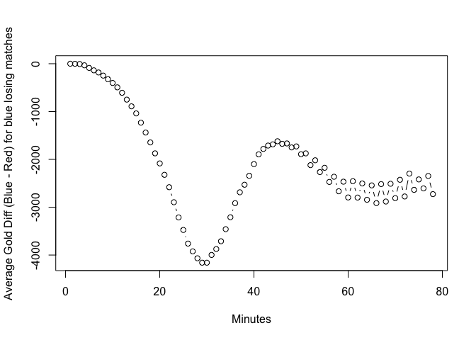
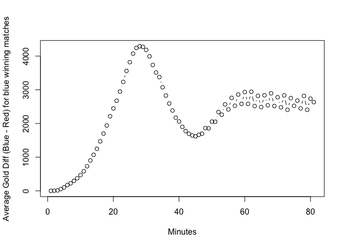
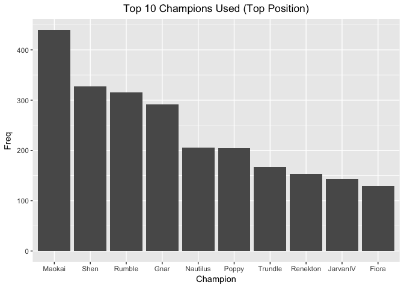
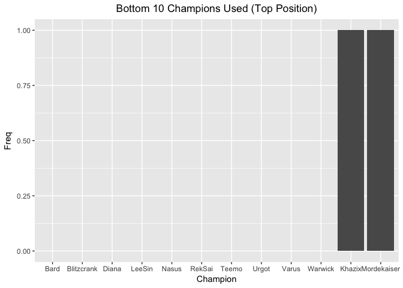
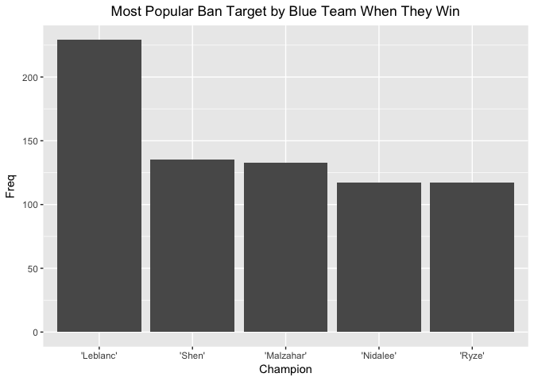
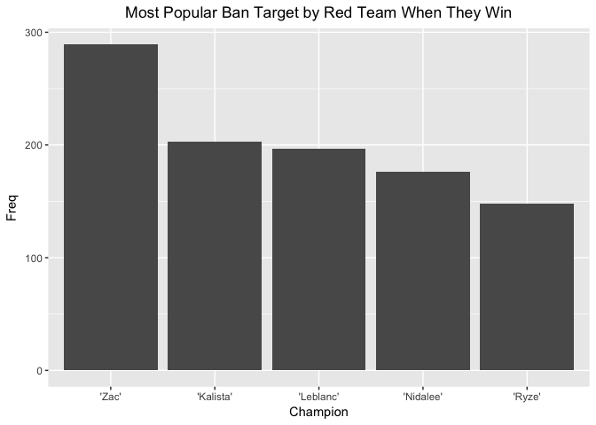

> Do we need to segregate the matches by type?   
> How does type influence the match gameplay? 

golddiff is defined as goldblue - goldred, by the minute  

> Can we can remove goldblue, goldred? Is the actual quantity significant? 

> There are 4 categories of games. 


```r
matches <- read.csv("matches.csv")

match_categories <- unique(matches$Type)
print(match_categories)
```

```
## [1] Season        Playoffs      Regional      International
## Levels: International Playoffs Regional Season
```

```r
print(length(match_categories))
```

```
## [1] 4
```

> Analyzing impact of golddiff on wins/losses


```r
# extract just golddiff for analysis
blue_loss_matches <- matches[matches$bResult==0,]
just_gold_diff = gsub("\\[|\\]", "", blue_loss_matches$golddiff)
golddiff_split_by_min = do.call("rbind", strsplit(just_gold_diff, ",")) # remove the , 
```

```
## Warning in rbind(c("0", " 0", " -26", " -18", " 147", " 237", " -152", "
## 18", : number of columns of result is not a multiple of vector length (arg
## 1)
```

```r
golddiff_split_by_min = data.frame(apply(golddiff_split_by_min, 2, as.numeric)) # convert str to num
head(golddiff_split_by_min)
```

```
##   X1  X2  X3   X4   X5   X6   X7    X8    X9   X10   X11   X12   X13   X14
## 1  0   0 -26  -18  147  237 -152    18    88  -242   102   117   802  1420
## 2  0   0 -15   25  228   -6 -243   175  -346    16  -258   -57  -190  -111
## 3  0   0  20  -42  -48  -24 -219  -272  -319  -554  -507  -557   231   571
## 4  0 -10   0  162 -269  -63  323   225   274   624   428   880   671   545
## 5  0   0   6 -532 -286 -533 -556 -1535 -1925 -1686 -2688 -2713 -2462 -2771
## 6  0  10  -7   78    7 -146  206    75  -136    15    74  -496  -672   383
##     X15   X16   X17   X18   X19   X20   X21   X22   X23   X24   X25   X26
## 1  1394  1301  1489  1563  1368  1105   205   192   587   377   667   415
## 2  -335    -8   324   428  -124   768  2712  1813   198  1242  1245  1278
## 3   781  -820  -679 -2358 -3213 -3256 -3528 -6883 -6735 -7052     0     0
## 4   317  1054  1034  1864  2327  2170  1908  -783   586   893  1092  1688
## 5 -3055 -2971 -3718 -3848 -3675 -5737 -5423 -4776 -4799 -4914 -5119 -7095
## 6  -832 -1726 -2348 -2074 -3275 -3127 -4284 -3966 -4073 -4934 -5242 -5228
##     X27   X28   X29    X30    X31   X32   X33    X34    X35    X36    X37
## 1  1876  1244  2130   2431    680  1520   949   1894   2644   3394   3726
## 2  1240  -664 -1195  -1157  -2161 -2504 -3873  -3688  -3801  -3668  -3612
## 3    20   -42   -48    -24   -219  -272  -319   -554   -507   -557    231
## 4   589   366  1181    299     48   128  -582  -3348  -4829  -5011  -5067
## 5 -6895 -6752 -9541 -10063 -10854     0     0      6   -532   -286   -533
## 6 -6740 -7569 -7808  -8491  -8960 -9816 -9979 -10888 -12400 -12490 -14931
##      X38    X39    X40    X41   X42   X43   X44   X45   X46   X47   X48
## 1   1165      0      0    -26   -18   147   237  -152    18    88  -242
## 2  -5071  -2825  -1464  -4507     0     0   -15    25   228    -6  -243
## 3    571    781   -820   -679 -2358 -3213 -3256 -3528 -6883 -6735 -7052
## 4  -4971  -6531  -6722 -10914     0   -10     0   162  -269   -63   323
## 5   -556  -1535  -1925  -1686 -2688 -2713 -2462 -2771 -3055 -2971 -3718
## 6 -17765 -19807 -20606      0    10    -7    78     7  -146   206    75
##     X49   X50   X51   X52   X53   X54   X55   X56   X57   X58   X59   X60
## 1   102   117   802  1420  1394  1301  1489  1563  1368  1105   205   192
## 2   175  -346    16  -258   -57  -190  -111  -335    -8   324   428  -124
## 3     0     0    20   -42   -48   -24  -219  -272  -319  -554  -507  -557
## 4   225   274   624   428   880   671   545   317  1054  1034  1864  2327
## 5 -3848 -3675 -5737 -5423 -4776 -4799 -4914 -5119 -7095 -6895 -6752 -9541
## 6  -136    15    74  -496  -672   383  -832 -1726 -2348 -2074 -3275 -3127
##      X61    X62   X63   X64   X65   X66   X67   X68   X69   X70   X71
## 1    587    377   667   415  1876  1244  2130  2431   680  1520   949
## 2    768   2712  1813   198  1242  1245  1278  1240  -664 -1195 -1157
## 3    231    571   781  -820  -679 -2358 -3213 -3256 -3528 -6883 -6735
## 4   2170   1908  -783   586   893  1092  1688   589   366  1181   299
## 5 -10063 -10854     0     0     6  -532  -286  -533  -556 -1535 -1925
## 6  -4284  -3966 -4073 -4934 -5242 -5228 -6740 -7569 -7808 -8491 -8960
##     X72   X73    X74    X75    X76    X77    X78
## 1  1894  2644   3394   3726   1165      0      0
## 2 -2161 -2504  -3873  -3688  -3801  -3668  -3612
## 3 -7052     0      0     20    -42    -48    -24
## 4    48   128   -582  -3348  -4829  -5011  -5067
## 5 -1686 -2688  -2713  -2462  -2771  -3055  -2971
## 6 -9816 -9979 -10888 -12400 -12490 -14931 -17765
```

```r
plot(colMeans(golddiff_split_by_min), type="b", xlab="Minutes", ylab="Average Gold Diff (Blue - Red) for blue losing matches") 
```

<!-- -->


```r
blue_win_matches <- matches[matches$bResult==1,]
just_gold_diff = gsub("\\[|\\]", "", blue_win_matches$golddiff)
golddiff_split_by_min = do.call("rbind", strsplit(just_gold_diff, ",")) # remove the , 
```

```
## Warning in rbind(c("0", " 0", " -14", " -65", " -268", " -431", " -488", :
## number of columns of result is not a multiple of vector length (arg 1)
```

```r
golddiff_split_by_min = data.frame(apply(golddiff_split_by_min, 2, as.numeric)) # convert str to num
head(golddiff_split_by_min)
```

```
##   X1 X2  X3  X4   X5   X6   X7   X8   X9  X10   X11  X12  X13  X14  X15
## 1  0  0 -14 -65 -268 -431 -488 -789 -494 -625 -1044 -313 -760 -697 -790
## 2  0  0  10 -60   34   37  589 1064 1258  913  1233 1597 1575 3046 2922
## 3 40 40  44 -36  113  158 -121 -191   23  205   156  272 -271 -896 -574
## 4  0 13  -7   6 -353 -215 -795 -764  369  359  1272 1297 1423 1940 1017
## 5  0  0  26  91 -109  264  178   66  -65  206   561  635 -437 -214 -303
## 6  0  0   0  68  498  210  283  311  133  291   327   98   72  212   17
##    X16  X17  X18  X19  X20  X21  X22  X23  X24  X25  X26  X27  X28  X29
## 1 -611  240  845  797 1422  987  169  432  491 1205 1527 1647 1847 3750
## 2 3074 3626 3466 5634 5293 4597 4360 4616 4489 4880 5865 6993 7049 7029
## 3  177 -425 -730 -318  478  926  761 -286  473  490 1265 2526 3890 4319
## 4 1168  951 1566 1388 2252 4167 4654 4779 4757 6601 7242 7864 8188 8819
## 5 -523  310  422 1367 1365 1213 1110 2263 2842 3114 3601 3417 4095 4336
## 6 -183  488 -631 -896  -17  286  349 -179 1143  294  934 3183 3854 5277
##     X30   X31   X32  X33  X34   X35   X36   X37   X38   X39   X40   X41
## 1  4719  3561  3367 2886 2906  4411  4473  4639  4762  4686  6057     0
## 2  7047  7160  7081 7582 9917 10337  9823 12307 13201 13924 13915     0
## 3  5121  5140  5141 6866 9517 11322    40    40    44   -36   113   158
## 4 10468 10500  9476 9231 9942 10855 10752 12532 11690 14093     0    13
## 5  4441   548  1638 3723 4331  5514  5961  6835  6704  8622  8446 10977
## 6  5775  8445 10867    0    0     0    68   498   210   283   311   133
##     X42   X43  X44  X45  X46  X47  X48  X49  X50   X51  X52  X53  X54  X55
## 1     0   -14  -65 -268 -431 -488 -789 -494 -625 -1044 -313 -760 -697 -790
## 2     0    10  -60   34   37  589 1064 1258  913  1233 1597 1575 3046 2922
## 3  -121  -191   23  205  156  272 -271 -896 -574   177 -425 -730 -318  478
## 4    -7     6 -353 -215 -795 -764  369  359 1272  1297 1423 1940 1017 1168
## 5 10857 15396    0    0   26   91 -109  264  178    66  -65  206  561  635
## 6   291   327   98   72  212   17 -183  488 -631  -896  -17  286  349 -179
##    X56  X57  X58  X59  X60  X61  X62  X63   X64  X65  X66  X67  X68   X69
## 1 -611  240  845  797 1422  987  169  432   491 1205 1527 1647 1847  3750
## 2 3074 3626 3466 5634 5293 4597 4360 4616  4489 4880 5865 6993 7049  7029
## 3  926  761 -286  473  490 1265 2526 3890  4319 5121 5140 5141 6866  9517
## 4  951 1566 1388 2252 4167 4654 4779 4757  6601 7242 7864 8188 8819 10468
## 5 -437 -214 -303 -523  310  422 1367 1365  1213 1110 2263 2842 3114  3601
## 6 1143  294  934 3183 3854 5277 5775 8445 10867    0    0    0   68   498
##     X70  X71  X72  X73   X74   X75   X76   X77   X78   X79   X80  X81
## 1  4719 3561 3367 2886  2906  4411  4473  4639  4762  4686  6057    0
## 2  7047 7160 7081 7582  9917 10337  9823 12307 13201 13924 13915    0
## 3 11322   40   40   44   -36   113   158  -121  -191    23   205  156
## 4 10500 9476 9231 9942 10855 10752 12532 11690 14093     0    13   -7
## 5  3417 4095 4336 4441   548  1638  3723  4331  5514  5961  6835 6704
## 6   210  283  311  133   291   327    98    72   212    17  -183  488
```

```r
plot(colMeans(golddiff_split_by_min), type="b", xlab="Minutes", ylab="Average Gold Diff (Blue - Red) for blue winning matches") 
```

<!-- -->
This graph is almost an inversion of the one before -> leading one to believe that gold amassed is directly correlated to winning. 


Identifying Best Champions to Use
The following is an exercise using *only* TOP position data. 


```r
unique(matches$blueTopChamp)
```

```
##  [1] Irelia      Gnar        Renekton    Kassadin    Sion       
##  [6] Jax         Lulu        Maokai      Rumble      Lissandra  
## [11] RekSai      Fizz        Morgana     Kennen      Gragas     
## [16] DrMundo     Vladimir    Hecarim     Ryze        Ekko       
## [21] Shen        Nautilus    Khazix      Riven       Olaf       
## [26] Shyvana     Yasuo       Malphite    Fiora       TahmKench  
## [31] Poppy       Gangplank   Graves      Quinn       Trundle    
## [36] Pantheon    Rammus      Swain       JarvanIV    Illaoi     
## [41] Lucian      Jayce       Camille     Singed      Kled       
## [46] Galio       Chogath     Nasus       Cassiopeia  Azir       
## [51] Yorick      Diana       Nocturne    LeeSin      Zac        
## [56] Taliyah     Malzahar    Akali       Teemo       Bard       
## [61] Nidalee     Nunu        Rengar      Sejuani     Mordekaiser
## [66] Varus       Kayle       Darius      Zed         XinZhao    
## [71] Blitzcrank  Talon       Urgot       Alistar     Warwick    
## 75 Levels: Akali Alistar Azir Bard Blitzcrank Camille ... Zed
```

```r
with(matches, cor(as.numeric(matches$blueTop), as.numeric(matches$blueTopChamp)))
```

```
## [1] 0.01241426
```
There are 75 different champions used in the *top* position. 
There is not a strong correlation between the player and the champion that they use in the matches (for top position). 

```r
library(ggplot2)
blue_win_matches = matches[matches$bResult==1,]
t <- table(blue_win_matches$blueTopChamp) # gets frequencies
t_sorted = sort(t, decreasing=TRUE)[1:10] # sorts and gets top 10
t_sorted_df = data.frame(t_sorted)
names(t_sorted_df)[names(t_sorted_df) == 'Var1'] <- 'Champion'
ggplot(t_sorted_df, aes(x=Champion,y =Freq)) +geom_bar(stat = "identity") + ggtitle("Top 10 Champions Used (Top Position)") + theme(plot.title = element_text(hjust = 0.5))
```

<!-- -->
Now the bottom 10 Champions. (least frequently used)

```r
t_sorted = sort(t, decreasing=FALSE)[1:12] # sorts and gets bottom 11
t_sorted_df = data.frame(t_sorted)
names(t_sorted_df)[names(t_sorted_df) == 'Var1'] <- 'Champion'
ggplot(t_sorted_df, aes(x=Champion,y =Freq)) +geom_bar(stat = "identity") + ggtitle("Bottom 10 Champions Used (Top Position)") + theme(plot.title = element_text(hjust = 0.5))
```

<!-- -->

In blue winning matches, some champions like Bard, Teemo, Urgot are not used at all!  
> One possible strategy is to avoid using these champions. 

> Most popular player to ban by blue


```r
winning_matches <- matches[matches$bResult==1,]
blue_bans = gsub("\\[|\\]", "", winning_matches$blueBans)
blue_bans = do.call("rbind", strsplit(blue_bans, ",")) # remove the , 
```

```
## Warning in rbind(c("'Rumble'", " 'Kassadin'", " 'Lissandra'"),
## c("'JarvanIV'", : number of columns of result is not a multiple of vector
## length (arg 1)
```

```r
t1 <- sort(table(blue_bans[,1]), decreasing=TRUE)[1:5]
t_sorted_df = data.frame(t1)
names(t_sorted_df)[names(t_sorted_df) == 'Var1'] <- 'Champion'
ggplot(t_sorted_df, aes(x=Champion,y =Freq)) +geom_bar(stat = "identity") + ggtitle("Most Popular Ban Target by Blue Team When They Win") + theme(plot.title = element_text(hjust = 0.5))
```

<!-- -->


```r
winning_matches <- matches[matches$rResult==1,]
red_bans = gsub("\\[|\\]", "", winning_matches$redBans)
red_bans = do.call("rbind", strsplit(red_bans, ",")) # remove the , 
```

```
## Warning in rbind(c("'RekSai'", " 'Janna'", " 'Leblanc'"), c("'RekSai'", :
## number of columns of result is not a multiple of vector length (arg 1)
```

```r
t1 <- sort(table(red_bans[,1]), decreasing=TRUE)[1:5]
t_sorted_df = data.frame(t1)
names(t_sorted_df)[names(t_sorted_df) == 'Var1'] <- 'Champion'
ggplot(t_sorted_df, aes(x=Champion,y =Freq)) +geom_bar(stat = "identity") + ggtitle("Most Popular Ban Target by Red Team When They Win") + theme(plot.title = element_text(hjust = 0.5))
```

<!-- -->


