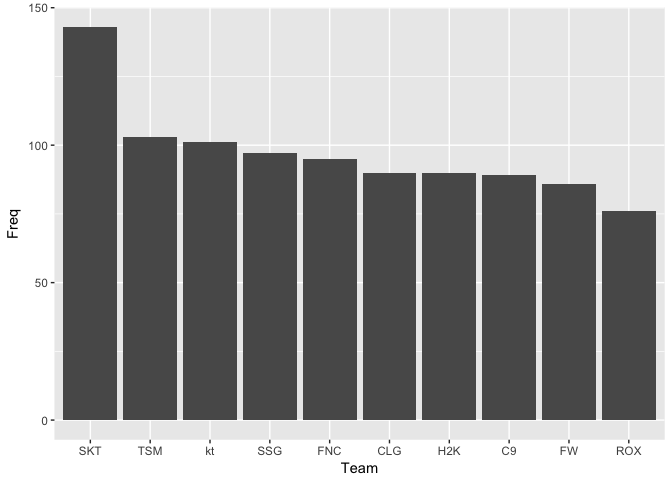
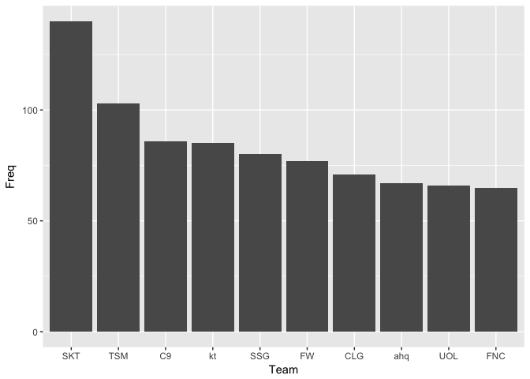
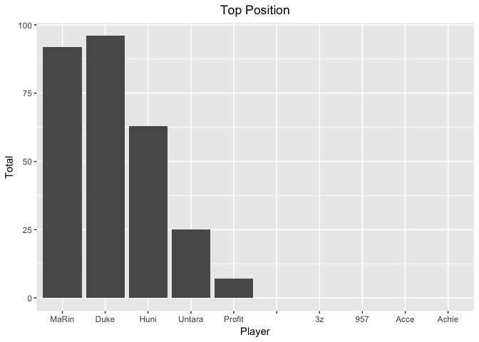
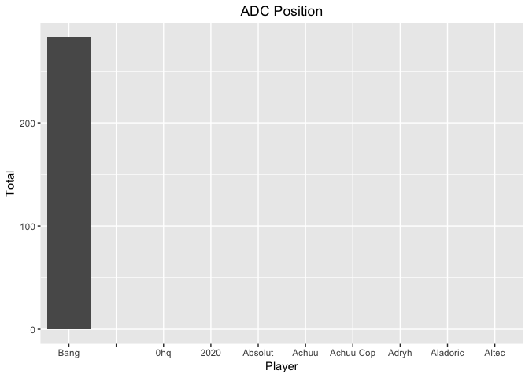
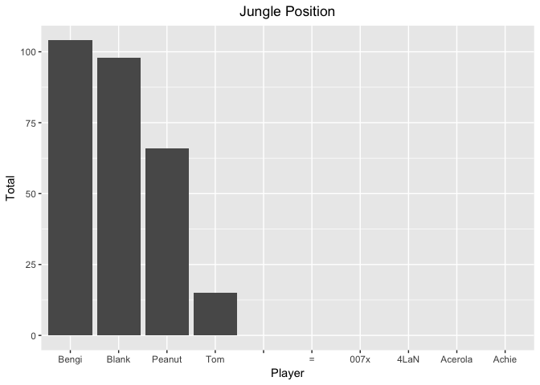
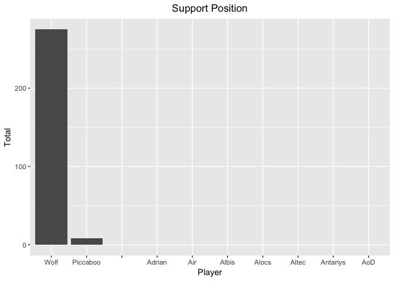
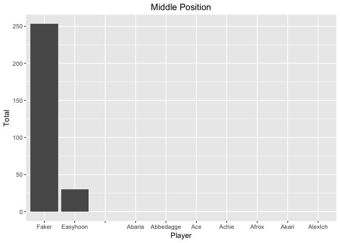
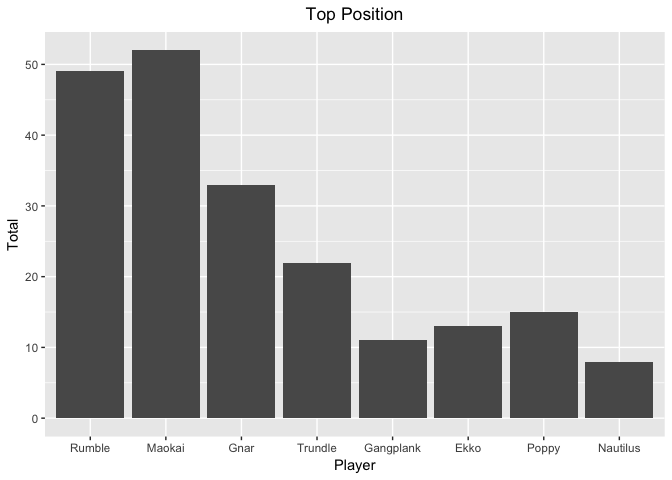
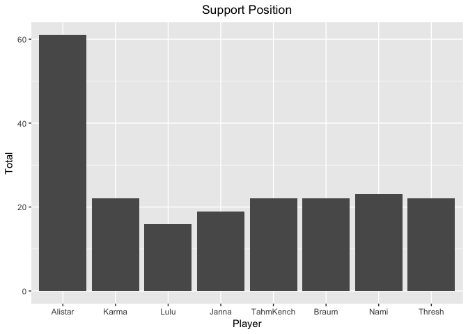
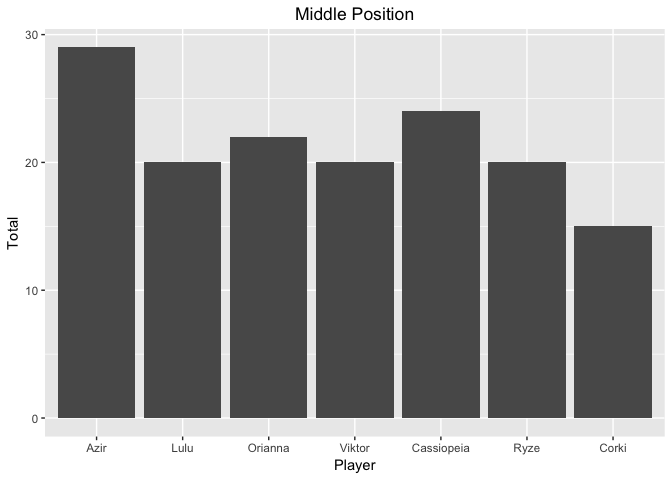

```r
rm(list=ls()) # cleanup
matches <- read.csv("/Users/pierlim/R_Projects/League_Of_Legends/matches.csv")
bluewin <- subset(matches, matches$bResult==1)
redwin <- subset(matches, matches$rResult==1)
```

**See blue top winning teams ** 


```r
t <- table(bluewin$blueTeamTag)
t_sorted = sort(t, decreasing=TRUE)[1:10] # sorts and gets top 10
t_sorted_df = data.frame(t_sorted)
names(t_sorted_df)[names(t_sorted_df) == 'Var1'] <- 'Team'
ggplot(t_sorted_df, aes(x=Team,y=Freq)) +geom_bar(stat = "identity")
```

<!-- -->

See top winning red teams.


```r
t <- table(redwin$redTeamTag)
t_sorted = sort(t, decreasing=TRUE)[1:10] # sorts and gets top 10
t_sorted_df = data.frame(t_sorted)
names(t_sorted_df)[names(t_sorted_df) == 'Var1'] <- 'Team'
ggplot(t_sorted_df, aes(x=Team,y=Freq)) +geom_bar(stat = "identity")
```

<!-- -->

Okay, Blue Team SKT clearly has the most wins, regardless of whether they are blue or red. 
Let's take out all the games where SKT won, and analyze this particular team to see what is their magic. 

** Analyzing the Top Team ** 


```r
library(plyr)

blue_skt_wins <- subset(bluewin, bluewin$blueTeamTag=="SKT")
red_skt_wins <- subset(redwin, redwin$redTeamTag=="SKT")

# Function to combine positions for blue skt and red skt wins
plotTopPlayersForPositionCombined <- function(dataset1, col_name1, dataset2, col_name2, titleStr){
  t1 <- table(dataset1[[col_name1]])
  t1_sorted = sort(t1, decreasing=TRUE)[1:10]
  t1_sorted_df = data.frame(t1_sorted)
  t2 <- table(dataset2[[col_name2]])
  t2_sorted = sort(t2, decreasing=TRUE)[1:10]
  t2_sorted_df = data.frame(t2_sorted)
  names(t2_sorted_df)[names(t2_sorted_df) == 'Freq'] <- 'Freq2'
  new_df <- merge(t1_sorted_df, t2_sorted_df, all.x=TRUE)
  new_df <- ddply(new_df, .(Var1, Freq, Freq2), summarise, Total=sum(Freq, Freq2))
  names(new_df)[names(new_df) == 'Var1'] <- 'Player'
  ggplot(new_df, aes(x=Player,y=Total)) +geom_histogram(stat = "identity")+ggtitle(titleStr) + theme(plot.title = element_text(hjust = 0.5))
}

plotTopPlayersForPositionCombined(blue_skt_wins, 'blueTop', red_skt_wins, 'redTop', "Top Position")
```

```
## Warning: Ignoring unknown parameters: binwidth, bins, pad
```

<!-- -->

```r
plotTopPlayersForPositionCombined(blue_skt_wins, 'blueADC', red_skt_wins, 'redADC', "ADC Position")
```

```
## Warning: Ignoring unknown parameters: binwidth, bins, pad
```

<!-- -->

```r
plotTopPlayersForPositionCombined(blue_skt_wins, 'blueJungle', red_skt_wins, 'redJungle', "Jungle Position")
```

```
## Warning: Ignoring unknown parameters: binwidth, bins, pad
```

<!-- -->

```r
plotTopPlayersForPositionCombined(blue_skt_wins, 'blueSupport', red_skt_wins, 'redSupport', "Support Position")
```

```
## Warning: Ignoring unknown parameters: binwidth, bins, pad
```

<!-- -->

```r
plotTopPlayersForPositionCombined(blue_skt_wins, 'blueMiddle', red_skt_wins, 'redMiddle', "Middle Position")
```

```
## Warning: Ignoring unknown parameters: binwidth, bins, pad
```

<!-- -->

It's very interesting - it's not so much the champions, but the players themselves play the same position almost all of the time! They are highly specialized.

For SKT team, the most frequent player at each position is:

MaRin/Duke at Top position
Bang at ADC position (Bang is the only one who sometimes plays at Jungle position)
Bengi/Blank/Peanut at Jungle position
Wolf at Support position
Faker at Middle position

We can go one step further to see which are the most frequent combos based on this data, if required. 


```r
plotTopChampionsForPositionCombined <- function(dataset1, col_name1, dataset2, col_name2, titleStr){
  t1 <- table(dataset1[[col_name1]])
  t1_sorted = sort(t1, decreasing=TRUE)[1:10]
  t1_sorted_df = data.frame(t1_sorted)
  t2 <- table(dataset2[[col_name2]])
  t2_sorted = sort(t2, decreasing=TRUE)[1:10]
  t2_sorted_df = data.frame(t2_sorted)
  names(t2_sorted_df)[names(t2_sorted_df) == 'Freq'] <- 'Freq2'
  new_df <- merge(t1_sorted_df, t2_sorted_df, all.x=TRUE)
  names(new_df)[names(new_df) == 'Var1'] <- 'Player'
  new_df <- ddply(new_df, .(Player, Freq, Freq2), summarise, Total=sum(Freq, Freq2))
  new_df <- new_df[complete.cases(new_df), ] # remove NA
  new_df <- new_df[with(new_df, order(-Total)),]

  ggplot(new_df, aes(x=Player,y=Total)) +geom_histogram(stat = "identity")+ggtitle(titleStr) + theme(plot.title = element_text(hjust = 0.5))
}

plotTopChampionsForPositionCombined(blue_skt_wins, 'blueTopChamp', red_skt_wins, 'redTopChamp', "Top Position")
```

```
## Warning: Ignoring unknown parameters: binwidth, bins, pad
```

<!-- -->

```r
plotTopChampionsForPositionCombined(blue_skt_wins, 'blueADCChamp', red_skt_wins, 'redADCChamp', "ADC Position")
```

```
## Warning: Ignoring unknown parameters: binwidth, bins, pad
```

<!-- -->

```r
plotTopChampionsForPositionCombined(blue_skt_wins, 'blueJungleChamp', red_skt_wins, 'redJungleChamp', "Jungle Position")
```

```
## Warning: Ignoring unknown parameters: binwidth, bins, pad
```

<!-- -->

```r
plotTopChampionsForPositionCombined(blue_skt_wins, 'blueSupportChamp', red_skt_wins, 'redSupportChamp', "Support Position")
```

```
## Warning: Ignoring unknown parameters: binwidth, bins, pad
```

<!-- -->

```r
plotTopChampionsForPositionCombined(blue_skt_wins, 'blueMiddleChamp', red_skt_wins, 'redMiddleChamp', "Middle Position")
```

```
## Warning: Ignoring unknown parameters: binwidth, bins, pad
```

<!-- -->

For Champions, there definitely are favourite champions for each position, but as you can see it is more varied. 


